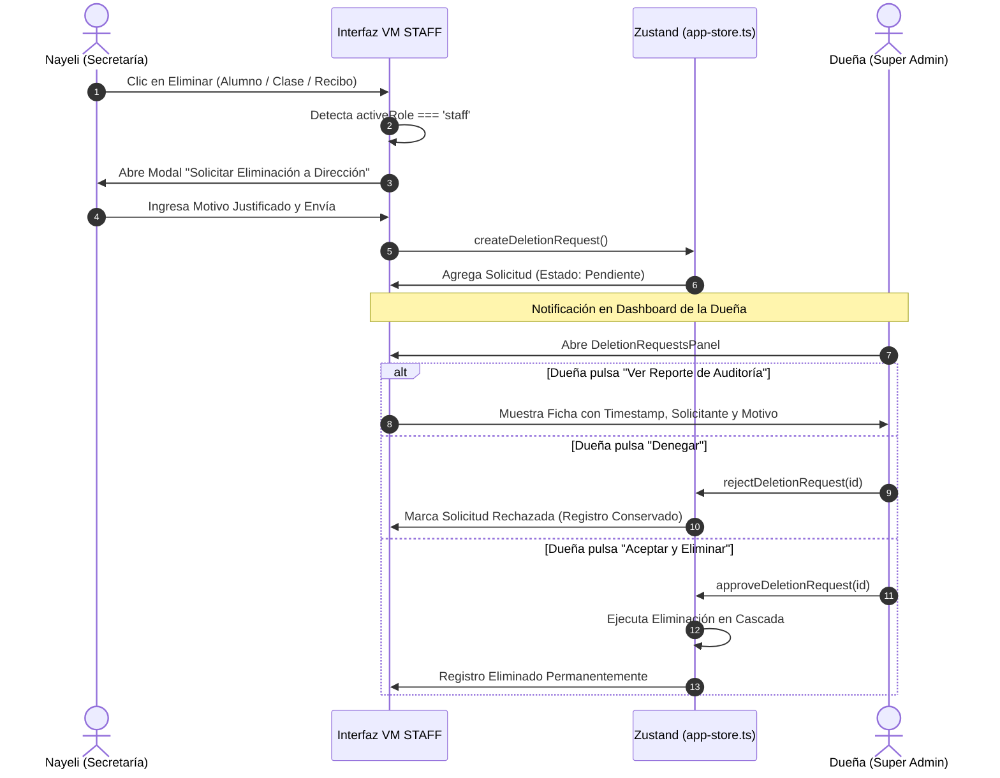

# ADR 005: 6 Funciones de Secretaría y Flujo de Aprobación de Eliminaciones con Auditoría Inmutable

## Estado
Aceptado e Implementado

## Contexto
1. Tras una auditoría exhaustiva con el equipo técnico senior y la dirección de Vibra Music, se definió el marco operativo oficial de las **6 funciones de la secretaria (Nayeli)**, las cuales también pueden ser ejercidas por la **Dueña (Super Admin)**.
2. Se requería un esquema de seguridad jerárquico para prevenir la pérdida accidental o no autorizada de datos:
   - **La Dueña (Super Admin)**: Cuenta con permisos plenos para eliminar registros de forma directa.
   - **La Secretaría (Nayeli)**: **No puede eliminar registros de manera permanente**. Al solicitar una eliminación (alumno, clase, recibo o alerta), el sistema debe retener el registro y generar una **Solicitud de Eliminación Protegida** en cola de espera para la Dueña.
3. La Dueña debe contar en su Dashboard con la facultad de **Aceptar** (ejecutar borrado en cascada), **Denegar** (mantener registro activo) y consultar un **Reporte de Auditoría** con fecha, hora exacta (timestamp), usuario solicitante y motivo justificado.

---

## Las 6 Funciones Operativas de Secretaría

### 1. Registro de Asistencia de Alumnos
- Marcado en vivo en la Ficha del Alumno y en la Agenda de clases:
  - Opciones de un clic: **✓ Presente**, **⏰ Tarde**, **✗ Falta**.
  - Cálculo automático y reactivo de la tasa de asistencia (`attendanceRate`) en tiempo real.

### 2. Registro de Matrículas
- Alta de nuevos alumnos mediante formulario integral (`NewStudentDialog`):
  - Captura de datos personales, familiares, instrumento y profesor asignado.
  - Fechas exactas de inicio de clases (`planStartDate`) y cálculo automático de fin (`planEndDate`).
  - Tipo de matrícula: Promo Demo (S/ 30), Regular (S/ 120), Exonerada.
  - Botón directo `+ Horario` para agendar sesiones semanales en 1 clic.

### 3. Registro de Reprogramaciones
- Módulo de reprogramación en `AgendaBoard`:
  - Selector de alcance: **⚡ Solo esta semana** (ajuste puntual) vs **🗓️ Todo el mes** (4 semanas completas).
  - Detección reactiva de conflictos de salas y profesores.

### 4. Atención de WhatsApp Business
- Enlace directo a la API de WhatsApp (`https://wa.me/`) con plantillas predefinidas:
  - **Bienvenida**: Confirmación de matrícula, profesor e instrumento.
  - **Cobranzas**: Recordatorio automático a familias morosas o con recibos por vencer.
  - **Coordinación**: Consultas operativas y pedagógicas.

### 5. Registro de Retiro de Alumnos (Pausas y Bajas)
- Módulo estructurado de retiros en `StudentsTable`:
  - Cambio de estado a **"En Pausa"** (mantiene ficha para reingreso) o **"Baja"** (libera vacantes en el horario).
  - Historial de alumnos anteriores y bajas para reincorporaciones rápidas.

### 6. Registro de Cobranzas y Abonos
- Módulo de Facturación en `admin.facturacion.tsx`:
  - Cobro total o abonos parciales (Yape, Plin, Efectivo, Transferencia).
  - Registro de Comprobante / N° de Operación de WhatsApp.
  - Bitácora inmutable de auditoría contable (`PaymentLog`) con usuario y hora.

---

## Regla de Capacidad de Aforo Máximo (5 Alumnos) y Asistente de Días Seguidos
1. **Aforo Máximo Estricto**:
   - Por cada franja horaria, sala y docente, la capacidad máxima es de **5 alumnos simultáneos**.
   - El sistema valida en tiempo real la ocupación (`enrolledCount < 5`) antes de permitir guardar una matrícula o reprogramación.
2. **Explorador de Vacantes en Tiempo Real (`VacancyAvailabilityPanel`)**:
   - Permite a Secretaría y Dirección consultar de inmediato:
     * Qué profesor tiene cupo libre el día `(X)` a la hora `(X)`.
     * Cantidad de vacantes restantes por cuadrante (ej. 3 libres de 5).
     * Ocultamiento inteligente de cuadrantes llenos (5/5).
3. **Asistente de Clases Consecutivas (Días Seguidos Excepcionales)**:
   - Resuelve los casos excepcionales (1 o 2 veces al mes) donde un alumno requiere clases en días seguidos (ej. Lunes y Martes, o Martes y Miércoles).
   - El asistente analiza automáticamente la disponibilidad del mismo docente en ambos días consecutivos y empareja los bloques con vacantes coincidentes.

---

## Flujo de Seguridad: Solicitudes de Eliminación Protegidas

---

## Consecuencias
- **Cero Pérdida Accidental de Datos**: Secretaría no puede borrar por error el padrón de alumnos ni las clases activas.
- **Trazabilidad Total**: Cada intento de eliminación queda registrado con fecha, hora exacta, solicitante y motivo.
- **Autonomía Operativa**: Secretaría gestiona asistencias, matrículas, cobranzas y WhatsApp de manera fluida sin trabas en su rutina diaria.
- **Supervisión de Dirección**: La Dueña conserva el control administrativo absoluto desde su Dashboard.
