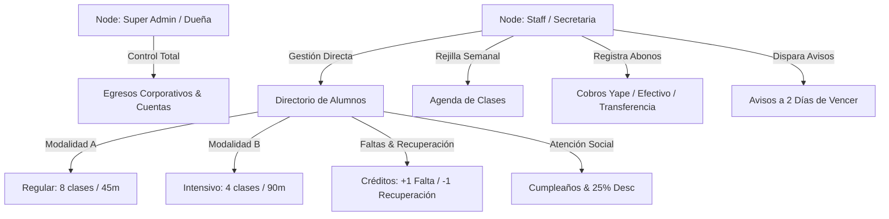

# Mapa de Memoria y Conocimiento (Engram): Vibra Music

Este documento constituye la memoria del sistema (**Engram**) que persiste el conocimiento de dominio, las reglas del negocio de la escuela de música Vibra Music y las restricciones arquitectónicas para la futura migración.

---

## 🧠 Grafo de Conocimiento del Dominio (Engram Nodes)

---

## 📌 Principios de Memoria Operativa Engram
1. **Segregación de Roles**: Super Admin vs Staff (Egresos protegidos vs Ingresos operativos).
2. **Modalidades Oficiales**:
   - Regular (8 clases x 45 min).
   - Intensivo (4 clases x 90 min).
3. **Gestión Transparente de Créditos**: Acumulación por inasistencia y deducción por recuperación asistida.
4. **Ciclo de Cobros a 2 Días**: Alertas preventivas previas a la fecha fija de vencimiento.

---

## 🔗 Referencias de Arquitectura y Grafos
- **Grafo de Dependencias (Graphify)**: [`docs/graphify/dependency_graph.mermaid`](file:///c:/Users/USER/my%20music%20staff/docs/graphify/dependency_graph.mermaid)
- **Grafo de Flujo de Datos (Graphify)**: [`docs/graphify/data_flow_graph.mermaid`](file:///c:/Users/USER/my%20music%20staff/docs/graphify/data_flow_graph.mermaid)
- **Matriz de Memoria JSON (Engram)**: [`docs/engram/memory_graph.json`](file:///c:/Users/USER/my%20music%20staff/docs/engram/memory_graph.json)
- **Registro de Auditoría de Bucles**: [`docs/logs/execution_tracker.log`](file:///c:/Users/USER/my%20music%20staff/docs/logs/execution_tracker.log)
