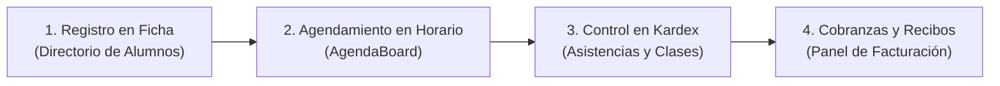
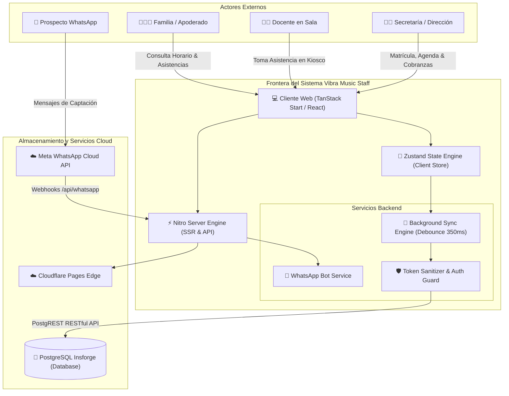
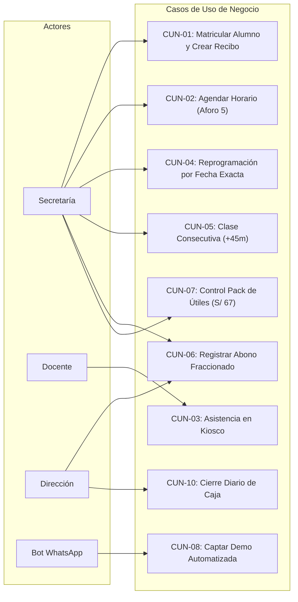
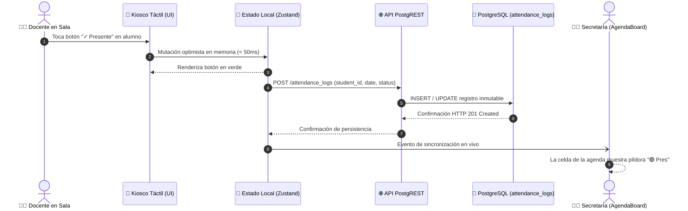
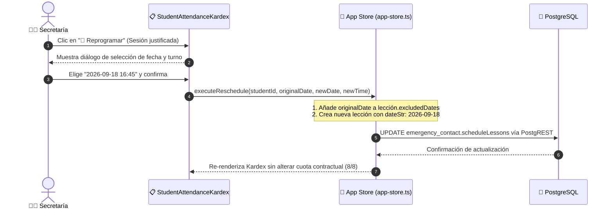
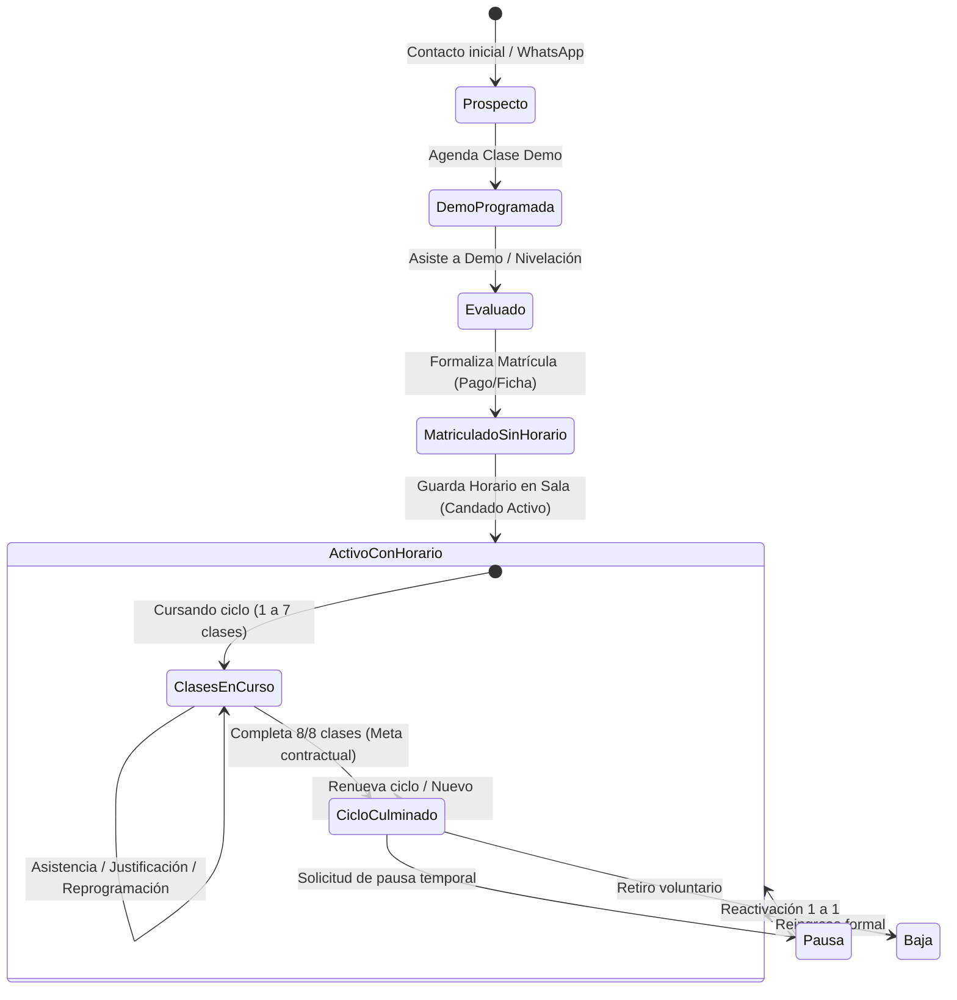
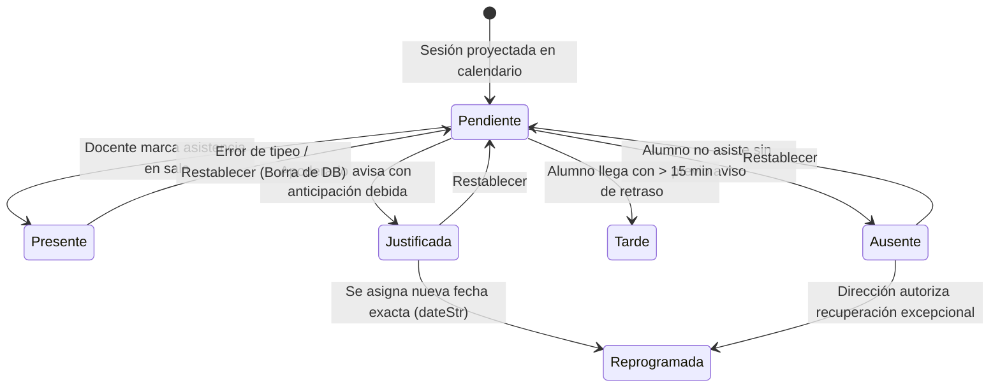
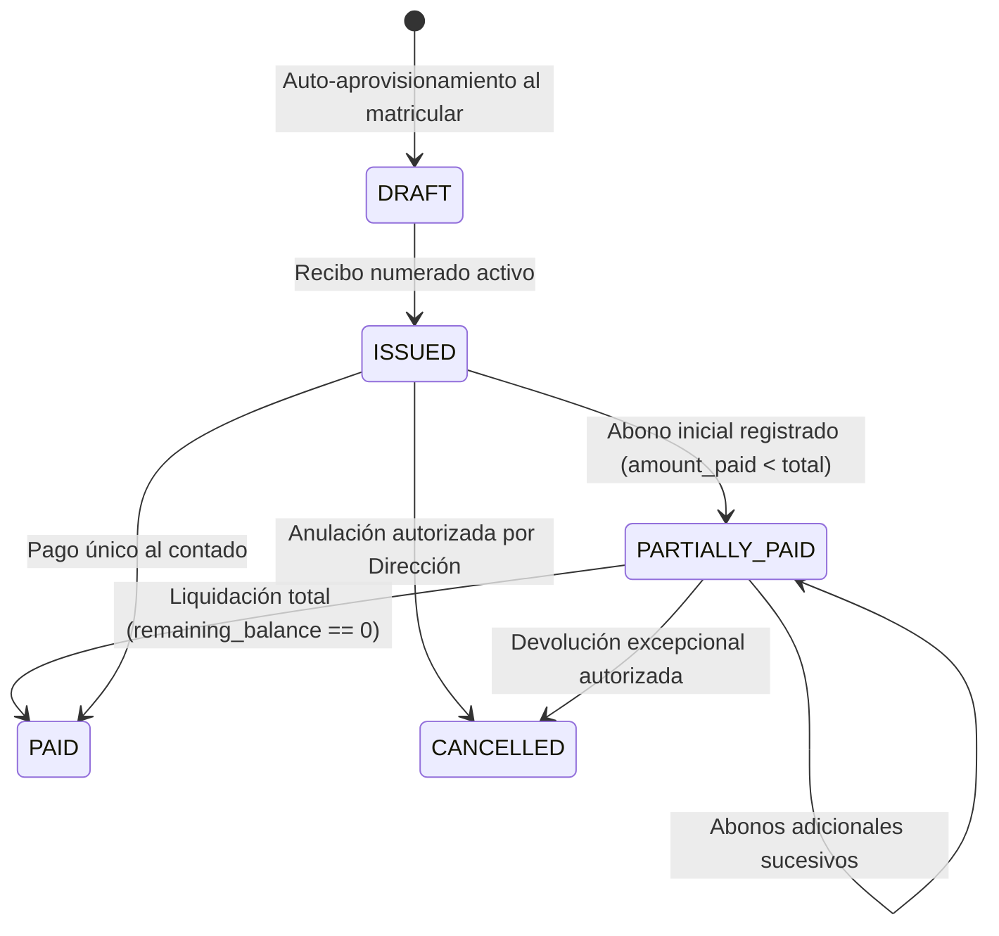
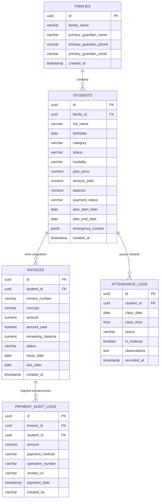

# ESPECIFICACIÓN DE REQUISITOS DE SOFTWARE (SRS)
## Sistema Integral de Gestión Académica, Pedagógica, Operativa y Financiera
### Vibra Music Staff — Escuela de Música (Sede Tacna, Perú)

---

| **Documento** | Especificación de Requisitos de Software (SRS) |
|---|---|
| **Proyecto** | Vibra Music Staff — Webapp Integral |
| **Versión** | 2.1.0 (Producción / Blueprint Maestro) |
| **Fecha de Emisión** | Setiembre 2026 |
| **Autor Institucional** | Equipo de Ingeniería de Software & Arquitectura de Sistemas |
| **Cliente / Institución** | Escuela de Música Vibra Music (Tacna, Perú) |
| **Estado del Documento** | Aprobado para Operación y Auditoría |
| **Formato Fuente** | Markdown (.md) preparado para conversión formal a .docx |

---

# ÍNDICE GENERAL

1. [SECCIÓN PRELIMINAR: FUNDAMENTOS DEL COMPORTAMIENTO DEL SOFTWARE](#1-sección-preliminar-fundamentos-del-comportamiento-del-software)
   - 1.1. Qué debe hacer la aplicación
   - 1.2. Cómo debe comportarse antes de comenzar la construcción (Contratos y Precondiciones)
   - 1.3. Principios de determinismo, trazabilidad y cero pérdida de datos
2. [CAPA 1: ALCANCE DEL PROYECTO](#2-capa-1-alcance-del-proyecto)
   - 2.1. Propósito y Límites del Sistema
   - 2.2. Módulos que componen la solución
   - 2.3. Exclusiones explícitas y alcance futuro
   - 2.4. Plataformas, Dispositivos e Interfaces de Usuario soportadas
   - 2.5. Ecosistema Tecnológico e Infraestructura de Despliegue
3. [CAPA 2: OBJETIVOS DEL PROYECTO](#3-capa-2-objetivos-del-proyecto)
   - 3.1. Objetivos Estratégicos Institucionales
   - 3.2. Objetivos Operativos de Eficiencia
   - 3.3. Objetivos Pedagógicos y de Calidad Educativa
   - 3.4. Métricas de Éxito Cuantitativas (KPIs de Software)
4. [CAPA 3: INFORMACIÓN DEL DOMINIO DEL PROBLEMA](#4-capa-3-información-del-dominio-del-problema)
   - 4.1. Introducción al Dominio de la Educación Musical Personalizada
   - 4.2. Problemática histórica de gestión en Vibra Music (El Excel de Nayeli y cuadernos físicos)
   - 4.3. Restricciones Físicas y Acústicas de Salas
   - 4.4. Glosario Exhaustivo de Funciones, Componentes y Utilidades del Sistema
5. [CAPA 4: NECESIDADES DE NEGOCIO Y MODELOS TARIFARIOS A IMPLANTAR](#5-capa-4-necesidades-de-negocio-y-modelos-tarifarios-a-implantar)
   - 5.1. Objetivos de Negocio de los Clientes (Familias, Apoderados y Alumnos)
   - 5.2. Objetivos de Negocio de los Usuarios Operativos del Sistema
     - 5.2.1. SuperAdmin / Dirección General (Dueña)
     - 5.2.2. Secretaría Académica y Caja (Nayeli)
     - 5.2.3. Planta Docente en Sala (Prof. Nathaly, Prof. Fernando, Prof. Jeremy)
   - 5.3. Catálogo Exhaustivo de Modelos de Negocio y Tarifario Oficial (2026)
     - 5.3.1. Modelo 1: Plan Regular 2x (8 clases / 45 min · S/ 297 mensual)
     - 5.3.2. Modelo 2: Plan Regular 1x/sem (8 clases / 45 min · S/ 297 en 2 meses)
     - 5.3.3. Modelo 3: Plan Intensivo (4 clases / 90 min · S/ 297 mensual)
     - 5.3.4. Modelo 4: Paquete Flexible a Demanda (24 sesiones / 45 min · S/ 500)
     - 5.3.5. Modelo 5: Clase Demo y Nivelación Individual (Tarifa Abierta)
     - 5.3.6. Servicios y Cobros Complementarios (Pack de Útiles S/ 67, Matrícula S/ 30, Descuentos)
6. [CAPA 5: DESCRIPCIÓN DETALLADA DE LOS PROCESOS DEL NEGOCIO (BPMN)](#6-capa-5-descripción-detallada-de-los-procesos-del-negocio-bpmn)
   - 6.1. Ciclo de Vida Inquebrantable de la Matrícula (Registro ➔ Horario ➔ Kardex ➔ Cobranzas)
   - 6.2. Regla de Candado: Bloqueo Condicional de Modalidad
   - 6.3. Proceso de Agendamiento, Validación de Aforo (5 alumnos) y Asignación de Salas
   - 6.4. Proceso de Toma de Asistencia en Kiosco Docente y Sincronización en Vivo
   - 6.5. Proceso de Reprogramación Puntual (Aislamiento por Fecha y `excludedDates`)
   - 6.6. Proceso de Clase Consecutiva de Corrido (+45 min)
   - 6.7. Proceso de Cierre Estricto de Ciclo Contractual (Resolución de Cuota)
   - 6.8. Proceso de Facturación, Emisión de Recibos y Abonos Fraccionados
   - 6.9. Proceso de Prospección y Captación Automatizada por WhatsApp Cloud API
7. [CAPA 6: CASOS DE USO DEL NEGOCIO Y ESPECIFICACIÓN DE ESCENARIOS](#7-capa-6-casos-de-uso-del-negocio-y-especificación-de-escenarios)
   - 7.1. Matriz de Actores del Negocio
   - 7.2. Catálogo Detallado de Casos de Uso del Negocio (CUN-01 al CUN-12)
8. [CAPA 7: DIAGRAMAS DEL SISTEMA Y ARQUITECTURA VISUAL (MERMAID)](#8-capa-7-diagramas-del-sistema-y-arquitectura-visual-mermaid)
   - 8.1. Diagrama de Contexto y Frontera del Sistema
   - 8.2. Diagrama Global de Casos de Uso
   - 8.3. Diagrama de Secuencia: Asistencia en Kiosco y Propagación en Tiempo Real
   - 8.4. Diagrama de Secuencia: Reprogramación Puntual y Kardex
   - 8.5. Diagrama de Máquina de Estados: Ciclo de Vida del Alumno
   - 8.6. Diagrama de Máquina de Estados: Estados de Asistencia de Sesión
   - 8.7. Diagrama de Máquina de Estados: Recibo de Pago (Invoice Lifecycle)
   - 8.8. Diagrama Entidad-Relación (ER) del Modelo de Datos PostgreSQL
9. [CAPA 8: REQUISITOS FUNCIONALES DEL SISTEMA (RF)](#9-capa-8-requisitos-funcionales-del-sistema-rf)
   - 9.1. Módulo 1: Agenda, Calendario y Horarios (RF-01 al RF-12)
   - 9.2. Módulo 2: Fichas de Alumnos y Familias (RF-13 al RF-24)
   - 9.3. Módulo 3: Kardex de Asistencias y Reprogramaciones (RF-25 al RF-36)
   - 9.4. Módulo 4: Kiosco Docente y Terminales de Sala (RF-37 al RF-44)
   - 9.5. Módulo 5: Facturación, Recibos y Caja Chica (RF-45 al RF-54)
   - 9.6. Módulo 6: Bot Oficial de WhatsApp Cloud API (RF-55 al RF-60)
10. [CAPA 9: REQUISITOS NO FUNCIONALES DEL SISTEMA (RNF)](#10-capa-9-requisitos-no-funcionales-del-sistema-rnf)
    - 10.1. Rendimiento y Latencia (RNF-01 a RNF-04)
    - 10.2. Seguridad, Autenticación y Control de Acceso (RNF-05 a RNF-08)
    - 10.3. Integridad, Persistencia y Tolerancia a Fallos (RNF-09 a RNF-12)
    - 10.4. Usabilidad, Ergonomía y Fidelidad de Marca (RNF-13 a RNF-16)
11. [ENTREGABLE 2: GESTIÓN ÁGIL EN TRELLO (SCRUM + KANBAN)](#11-entregable-2-gestión-ágil-en-trello-scrum--kanban)
    - 11.1. Estructura y Políticas del Tablero Trello Oficial
    - 11.2. Flujo de Estados de Tarjetas (Backlog ➔ En Curso ➔ Testeado ➔ Sprint Entregable)
    - 11.3. Matriz de Épicas y Desglose de Sprints
12. [ENTREGABLE 3: METODOLOGÍA DE DESARROLLO SPRINT A SPRINT](#12-entregable-3-metodología-de-desarrollo-sprint-a-sprint)
    - 12.1. Ciclo Iterativo e Incremental
    - 12.2. Definición de Hecho (Definition of Done - DoD)
    - 12.3. Control de Regresiones y Respeto a los ADRs
13. [ENTREGABLE 4: DEFINICIÓN Y CONSOLIDACIÓN DEL MVP](#13-entregable-4-definición-y-consolidación-del-mvp)
    - 13.1. Qué conformó el MVP de Vibra Music Staff
    - 13.2. Proceso de Validación en Sala y Criterios de Aceptación Cumplidos
14. [ENTREGABLE 5: ENTREGA TOTAL DEL CÓDIGO FUENTE Y ACTIVOS](#14-entregable-5-entrega-total-del-código-fuente-y-activos)
    - 14.1. Compromiso de Entrega Irrestricta
    - 14.2. Estructura del Repositorio y Componentes del Software
    - 14.3. Manual de Despliegue y Variables de Entorno
15. [ETAPA DOS: PLAN DE MANTENIMIENTO, SOPORTE CONTINUO Y SLA](#15-etapa-dos-plan-de-mantenimiento-soporte-continuo-y-sla)
    - 15.1. Acuerdos de Nivel de Servicio (SLA) y Severidades de Incidencia
    - 15.2. Procedimientos de Respaldo y Recuperación ante Desastres (DRP)
    - 15.3. Modelo Operativo de Mantenimiento Preventivo, Correctivo y Evolutivo
16. [ANEXO: HISTORIAL DE DECISIONES ARQUITECTÓNICAS (ADR-001 AL ADR-0128)](#16-anexo-historial-de-decisiones-arquitectónicas-adr-001-al-adr-0128)

---

# 1. SECCIÓN PRELIMINAR: FUNDAMENTOS DEL COMPORTAMIENTO DEL SOFTWARE

## 1.1. Qué debe hacer la aplicación
La aplicación web **Vibra Music Staff** es una solución informática integral diseñada para coordinar, automatizar y blindar la totalidad de las operaciones formativas, pedagógicas, administrativas y financieras de la Escuela de Música Vibra Music.

Específicamente, el software debe:
1. **Administrar la Agenda Formativa en Tiempo Real**: Proyectar y gestionar el cronograma de clases de Lunes a Sábado, resolviendo cupos por docente y por sala de manera automática, sin permitir cruces ni sobrecupos.
2. **Emular y Optimizar el Flujo Visual Histórico**: Replicar la distribución de celdas y la codificación por colores del Excel físico de secretaría (Nayeli), permitiendo la transición fluida del trabajo analógico al entorno digital en la nube.
3. **Dotar a la Planta Docente de un Kiosco Táctil Autónomo**: Permitir a los profesores pasar asistencia en menos de 5 segundos por alumno desde tablets situadas en cada sala, registrando el estado pedagógico sin acceder a datos financieros privados de las familias.
4. **Llevar el Historial Clínico de Clases (Kardex)**: Auditar el cumplimiento exacto de las clases contratadas (8 clases en plan regular, 4 en intensivo o 24 en flexible), gestionando reprogramaciones por fecha exacta y extensiones de clase de corrido (+45m).
5. **Controlar la Facturación y Recaudación Fraccionada**: Emitir recibos numerados correlativamente, registrar abonos en efectivo, Yape, Plin o transferencias con comprobante y número de operación, actualizando el saldo de la ficha del alumno en tiempo real.
6. **Captar Alumnos mediante WhatsApp Cloud API Oficial**: Atender prospectos de manera conversacional y automatizada, programando clases de evaluación/demo sin vulnerar las reglas pedagógicas de asignación de salas.

## 1.2. Cómo debe comportarse antes de comenzar la construcción (Contratos y Precondiciones)
Antes de ejecutar cualquier transacción en la base de datos o modificar el estado global, el software debe verificar y garantizar de forma determinista las siguientes condiciones:
* **Precondición Pedagógica Inquebrantable**: Un alumno nunca puede ser asignado a un profesor o sala que no corresponda a su edad o instrumento (Piano Infantil y Canto con Nathaly en Sala C; Piano Estándar y Violín con Fernando en Sala B; Guitarra y Batería con Jeremy en Sala A), ni siquiera ante falta temporal de cupos.
* **Precondición de Aforo**: Ningún turno de 45 minutos puede superar el límite estricto de **5 alumnos simultáneos** por docente. Si un sexto alumno intenta ser ingresado, el sistema debe bloquear la acción y emitir una alerta visual inmediata.
* **Precondición de Ciclo de Vida**: Un alumno no puede ser agendado en el calendario si no ha sido registrado previamente con su ficha de matrícula. Del mismo modo, el selector de modalidad se bloquea con candado tan pronto como el alumno tiene su primera clase activa guardada en la agenda.
* **Precondición de Inmutabilidad**: Una clase dictada y evaluada (`presente`, `ausente`, `tarde`, `justificada`) nunca puede ser borrada por la proyección de semanas posteriores ni por el cierre de ciclo.

## 1.3. Principios de determinismo, trazabilidad y cero pérdida de datos
* **Determinismo Matemático**: Dados los mismos parámetros de entrada (fecha de inicio, modalidad, docente y días pareados), el sistema debe calcular idéntica proyección de fechas tanto en la Agenda como en el Kardex.
* **Persistencia Inmutable**: Los registros de asistencia (`attendance_logs`) y de cobros (`payment_audit_logs`) constituyen pistas de auditoría de solo adición (*append-only*).
* **Protocolo STOP & VERIFY**: Queda prohibida la ejecución de instrucciones que causen pérdida masiva e irreversible de datos (`DROP TABLE`, `TRUNCATE` o `DELETE` sin cláusula WHERE).

---

# 2. CAPA 1: ALCANCE DEL PROYECTO

## 2.1. Propósito y Límites del Sistema
El propósito del sistema es erradicar los errores operativos de sobreventa de cupos, clases duplicadas, descontrol de asistencias y desfases de caja que ocurrían al operar con hojas de cálculo aisladas y cuadernos físicos.

El sistema delimita su frontera operativa a las sedes de la academia, coordinando la interacción directa entre:
* La Dirección General (Supervisión y auditoría).
* La Secretaría Académica (Operaciones de agendamiento y cobranza).
* La Planta Docente (Ejecución de clases y toma de asistencia en sala).
* Las Familias y Alumnos (Consulta de progreso y estado financiero).

## 2.2. Módulos que componen la solución
1. **Módulo de Autenticación y Control de Acceso por Roles (RBAC)**: Gestión de identidades con perfiles dedicados: Administrador, Secretaría, Profesor (Kiosco) y Familia.
2. **Módulo de Agenda Formativa y Horarios (`AgendaBoard`)**: Tablero tridimensional (Día/Par $\times$ Docente $\times$ Horario) con tres vistas: Didáctica Pareada, Diaria y Rejilla Semanal de Alta Densidad.
3. **Módulo de Alumnos y Familias (`StudentsTable`)**: Directorio reactivo con búsqueda normalizada, ficha médica, contacto de emergencia y control del Pack de Útiles y Libro.
4. **Módulo de Kardex y Asistencias (`StudentAttendanceKardex`)**: Registro individual de lecciones mensuales con soporte de reprogramaciones por fecha específica y clases consecutivas.
5. **Módulo de Kiosco Docente para Salas (`TeacherKiosk`)**: Interfaz táctil de respuesta instantánea optimizada para tablets de sala, con cola de persistencia offline.
6. **Módulo de Facturación y Cobranzas (`Billing`)**: Matriz de recibos, registro de abonos parciales, balance de deuda y auditoría de métodos de pago.
7. **Módulo Bot de WhatsApp Cloud API (`WhatsAppService`)**: Agente conversacional oficial para prospección, agendamiento de demos y confirmaciones.

## 2.3. Exclusiones explícitas y alcance futuro
* **Facturación Electrónica SUNAT**: En la versión actual 2.1.0, el sistema emite recibos internos de cobranza con valor administrativo y probatorio. La emisión directa de boletas electrónicas mediante PSE/OSE se difiere a la versión 3.0.
* **Control de Asistencia Biométrico**: La asistencia se registra de forma visual y pedagógica mediante el Kiosco Docente por el profesor en sala, excluyendo deliberadamente molinetes o huelleros físicos que despersonalizan el trato a los niños.

## 2.4. Plataformas, Dispositivos e Interfaces de Usuario soportadas
* **Puestos de Secretaría y Dirección**: Computadoras de escritorio y portátiles (Windows / macOS / Linux) con resoluciones desde $1366 \times 768$ hasta $4K$. Optimizado para teclado, mouse y atajos rápidos.
* **Terminales de Sala (Kiosco Docente)**: Tablets táctiles de 10" a 12.9" (iPad, tablets Android o pantallas táctiles dedicadas). Elementos de interfaz con altura mínima de 48px para pulsación táctil con un solo dedo.
* **Dispositivos Móviles de Supervisión**: Smartphones (iOS y Android) mediante interfaz web responsiva adaptativa con cajón lateral colapsable (*drawer*).

## 2.5. Ecosistema Tecnológico e Infraestructura de Despliegue
* **Framework Full-Stack**: TanStack Start + TanStack Router (enrutamiento de tipado estricto de extremo a extremo).
* **Motor de Renderizado y Servidor**: Nitro server engine optimizado para Cloudflare Pages y Node.js 24+.
* **Base de Datos y API de Persistencia**: PostgreSQL gestionado en Insforge, expuesto mediante API PostgREST (`/api/database/records`).
* **Capa de Estado del Cliente**: Zustand con almacenamiento persistente local (`persist` en `localStorage`) y reconciliador de sincronización en segundo plano (`useInsforgeSync`).
* **Estilos y Componentes de Interfaz**: TailwindCSS v3.4, Framer Motion para micro-interacciones, Lucide Icons y primitivas accesibles de Radix UI.

---

# 3. CAPA 2: OBJETIVOS DEL PROYECTO

## 3.1. Objetivos Estratégicos Institucionales
1. **Institucionalización de Procesos**: Transformar las reglas operativas tácitas en algoritmos deterministas protegidos por software, permitiendo la escalabilidad de la escuela sin depender de la memoria de personas clave.
2. **Cero Fugas de Ingresos**: Garantizar que ningún alumno reciba clases en sala si no cuenta con una matrícula registrada y un estado de pago regularizado o coordinado.
3. **Excelencia en la Experiencia Familiar**: Brindar a los padres de familia transparencia absoluta sobre el consumo de sus clases contratadas, acabando con las discusiones por clases no asistidas o feriados.

## 3.2. Objetivos Operativos de Eficiencia
1. **Reducción del 95% en Tiempos de Agendamiento**: Reducir el tiempo necesario para ubicar a un alumno en el horario de 15 minutos (revisando hojas impresas) a menos de 30 segundos en la grilla interactiva.
2. **Toma de Asistencia Inmediata**: Lograr que el docente tome la asistencia completa de sus 5 alumnos de sala en menos de 10 segundos al iniciar la hora pedagógica.
3. **Conciliación Financiera en Tiempo Real**: Eliminar el cuadre manual nocturno de caja, disponiendo del balance de ingresos en vivo al cierre del turno.

## 3.3. Objetivos Pedagógicos y de Calidad Educativa
1. **Respeto Irrestricto a los Aforos de Sala**: Asegurar que ningún docente tenga a su cargo más de 5 alumnos en una misma franja horaria, preservando la atención individualizada.
2. **Garantía de Especialidad Docente**: Asegurar que cada disciplina e instrumento sea impartido exclusivamente por el docente especialista contratado para ese fin.

## 3.4. Métricas de Éxito Cuantitativas (KPIs de Software)
| KPI | Meta Operativa | Umbral de Alerta |
|---|---|---|
| Tiempo de carga inicial de la Agenda (FCP) | $< 800\text{ ms}$ | $> 1500\text{ ms}$ |
| Latencia en persistencia de asistencia en Kiosco | $< 150\text{ ms}$ (local) / $< 600\text{ ms}$ (DB) | $> 2000\text{ ms}$ |
| Discrepancia matemática entre recibos y saldo en ficha | $0.00\text{ PEN}$ | Cualquier valor $\neq 0$ |
| Tasa de solapamiento de cupos o cruces de sala | $0.00\%$ | Cualquier cruce detectado |
| Disponibilidad mensual de la plataforma | $\ge 99.8\%$ | $< 99.0\%$ |

---

# 4. CAPA 3: INFORMACIÓN DEL DOMINIO DEL PROBLEMA

## 4.1. Introducción al Dominio de la Educación Musical Personalizada
A diferencia de academias académicas o centros de idiomas donde los alumnos asisten en grupos masivos que reciben la misma lección magistral, una **escuela de música contemporánea** opera bajo un modelo de **instrucción personalizada en turnos compartidos**.

En este modelo:
* En una misma sala y en una misma franja horaria de 45 minutos coinciden hasta 5 alumnos con el mismo docente.
* Sin embargo, cada alumno ejecuta una pieza musical distinta, tiene una edad particular, avanza a su propia velocidad técnica y utiliza su propio atril o instrumento.
* Esto exige que el sistema de software trate a cada alumno como una entidad con cronograma, asistencias, vigencia contractual y plan de estudios completamente individualizado, a pesar de compartir una celda visual en el horario.

## 4.2. Problemática histórica de gestión en Vibra Music
Antes de la implantación de Vibra Music Staff, la escuela operaba con un archivo de Excel denominado `HORARIO ORGANIZADO VIBRA MUSIC.xlsx` administrado por secretaría (Nayeli). 

Este método presentaba vulnerabilidades operativas críticas:
1. **Pérdida de Formato y Sobreescritura Accidental**: Un clic involuntario podía borrar el nombre de un alumno de su turno habitual sin dejar rastro de auditoría.
2. **Desconexión con las Asistencias**: El Excel de horarios no se comunicaba con las listas de asistencia de los profesores, generando dudas sobre si un alumno había faltado o si había asistido a una recuperación.
3. **Ambigüedad en Reprogramaciones**: Las clases recuperadas se anotaban al margen con notas de texto desordenadas, provocando que se dictaran más clases de las 8 contratadas.
4. **Desfase en Cobranzas**: Los pagos fraccionados quedaban anotados en cuadernos físicos, dificultando saber con certeza si un alumno que entraba a clase tenía saldo pendiente de pago.

## 4.3. Restricciones Físicas y Acústicas de Salas
La sede institucional cuenta con 3 salas formativas con acondicionamiento específico:

```
┌────────────────────────────────────────────────────────────────────────┐
│                        MAPA ACÚSTICO DE SALAS                          │
├────────────────────┬────────────────────┬──────────────────────────────┤
│ SALA A (Percusión) │ SALA B (Armonía)   │ SALA C (Iniciación y Voz)    │
│ Prof. Jeremy       │ Prof. Fernando     │ Prof. Nathaly                │
│ • Batería Acústica │ • Piano Estándar   │ • Piano Infantil (4 a 8 a.) │
│ • Guitarra Eléctr. │ • Violín Clásico   │ • Canto y Técnica Vocal      │
│ • Guitarra Clásica │ • Adultos y Máster │ • Tiny / Junior Inicial      │
│ Capacidad: 5 alumn.│ Capacidad: 5 alumn.│ Capacidad: 5 alumnos         │
└────────────────────┴────────────────────┴──────────────────────────────┘
```

* **Principio de Aislamiento Acústico**: Batería y Guitarra Eléctrica generan una presión sonora elevada que no puede convivir en la misma sala con instrumentos de arco o cuerda frotada como el Violín.
* **Principio de Pedagogía por Edad**: Los niños de 4 a 8 años requieren mobiliario adaptado, juegos rítmicos y acompañamiento de voz lírica/infantil (Sala C), mientras que jóvenes y adultos requieren lectura técnica y teoría en teclado estándar (Sala B).

## 4.4. Glosario Exhaustivo de Funciones, Componentes y Utilidades del Sistema

* **`AgendaBoard`**: Componente central de visualización del cronograma semanal que proyecta celdas interactivas distribuidas por día, hora, docente y sala.
* **Días Pareados**: Mecanismo institucional que agrupa las clases de frecuencia 2x en dos sesiones fijas semanales:
  * Par 0 (`L-M`): Lunes y Miércoles.
  * Par 1 (`M-J`): Martes y Jueves.
  * Par 2 (`V-S`): Viernes y Sábado.
* **Navegación Automática Determinista**: Función de inicialización reactiva que inspecciona el día en curso (`new Date().getDay()`) al cargar la aplicación y posiciona automáticamente el selector en la semana actual y en el par de días correspondiente (ej. si hoy es Viernes, se posiciona en el Par 2 `V-S` y en el día Viernes), permitiendo luego la libre navegación manual sin bloqueos.
* **Kiosco Docente (`TeacherKiosk`)**: Modo operativo simplificado diseñado para tablets táctiles de sala, que filtra las clases mostrando únicamente las del profesor autenticado, permitiendo el pase de lista de asistencia con botones de alto contraste táctil.
* **`StudentAttendanceKardex`**: Panel de auditoría cronológica del alumno que desglosa sesión por sesión del mes lectivo, computando asistencias evaluadas, pendientes, recuperaciones y cuota contractual.
* **Reprogramación Puntual con Aislamiento por Fecha**: Algoritmo mediante el cual una lección semanal recurrente que no pudo dictarse se mueve a una fecha fija (`dateStr: YYYY-MM-DD`). La lección original incorpora dicha fecha a su arreglo `excludedDates`, evitando que se cree una clase recurrente abierta y protegiendo el cronograma futuro.
* **Clase Consecutiva de Corrido (`+45m`)**: Utilidad que permite a un alumno tomar dos turnos pedagógicos continuos (90 minutos) en un día específico. La lección extra queda vinculada exclusivamente a esa fecha exacta mediante `dateStr`.
* **Cuota Contractual (`targetQuota`)**: Límite matemático inquebrantable de clases asignadas a un ciclo lectivo (8 para planes regulares, 4 para intensivos y 24 para flexible).
* **Cierre Dinámico de Ciclo (`computeStudentCycle`)**: Función matemática que evalúa si un alumno completó el 100% de las clases de su contrato (`evaluatedCount >= targetQuota`). Al cumplirse, oculta las sesiones pendientes proyectadas en semanas futuras para evitar clases fantasma, pero preserva de forma inmutable todas las clases evaluadas del pasado.
* **Bloqueo Condicional de Modalidad**: Regla en el formulario de horario que bloquea con candado el cambio de plan (`🔒 Horario activo`) si el alumno ya tiene clases agendadas en la grilla.
* **Auto-Aprovisionamiento de Recibos (`backgroundCreateInvoiceInDB`)**: Proceso en segundo plano que, al matricular a un alumno nuevo o reactivar a un alumno histórico, inserta de inmediato su recibo en la tabla `invoices`, garantiza la existencia de su registro familiar y persiste su log de pago en `payment_audit_logs`.
* **Debounce de Persistencia (350ms)**: Mecanismo de aplazamiento temporal en `backgroundSyncStudentToDB` que consolida las modificaciones consecutivas en formularios antes de transmitirlas a PostgreSQL, evitando bloqueos por colisión de escrituras (*race conditions*).
* **Sanitización de Tokens JWT (RFC 7519)**: Módulo en `src/lib/insforge.ts` que valida criptográficamente que un token de autorización cumpla con el estándar de tres segmentos separados por puntos antes de enviarlo a PostgREST, utilizando automáticamente la clave anónima en caso contrario para impedir errores HTTP 401.

---

# 5. CAPA 4: NECESIDADES DE NEGOCIO Y MODELOS TARIFARIOS A IMPLANTAR

## 5.1. Objetivos de Negocio de los Clientes (Familias, Apoderados y Alumnos)
* **Previsibilidad Horaria**: Conocer desde el momento de la matrícula el calendario completo de clases del mes, permitiendo organizar las rutinas familiares y escolares.
* **Flexibilidad sin Penalización Injusta**: Capacidad de justificar inasistencias por motivos de salud o exámenes con derecho a reprogramación dentro del periodo lectivo.
* **Claridad en Cobros y Comprobantes**: Disponer de recibos claros que indiquen el monto total contratado, los abonos entregados y el saldo pendiente.

## 5.2. Objetivos de Negocio de los Usuarios Operativos del Sistema

### 5.2.1. SuperAdmin / Dirección General (Dueña)
* **Supervisión y Auditoría Integral**: Monitorear en tiempo real la recaudación global de la academia, el estado de caja chica y los saldos por cobrar.
* **Aprobación de Acciones Sensibles**: Restringir el borrado de alumnos o anulación de recibos a una confirmación con credenciales de nivel maestro.
* **Toma de Decisiones basada en Ocupabilidad**: Analizar la tasa de vacantes por docente y sala para abrir nuevos turnos o campañas de captación.

### 5.2.2. Secretaría Académica y Caja (Nayeli)
* **Velocidad de Matrícula y Agendamiento**: Inscribir alumnos y asignarlos a la grilla en pocos clics, con validación visual inmediata de vacantes libres.
* **Gestión de Abonos Fraccionados**: Facilitar el cobro en partes (ej. reserva inicial y saldo al comenzar las clases) registrando números de operación de Yape, Plin o transferencias.
* **Control de Entregas de Material**: Registrar la entrega física del Pack de Útiles y Libro para asegurar que ningún alumno asista a sala sin su material didáctico.

### 5.2.3. Planta Docente en Sala (Prof. Nathaly, Prof. Fernando, Prof. Jeremy)
* **Pase de Lista con Cero Distracción**: Pasar lista de asistencia en menos de 5 segundos con pulsaciones táctiles directas.
* **Privacidad de la Relación Financiera**: Concentrarse exclusivamente en la pedagogía musical sin involucrarse en deudas o cobranzas de los alumnos.
* **Bitácora Pedagógica**: Registrar observaciones sobre el avance técnico y conductual del estudiante.

## 5.3. Catálogo Exhaustivo de Modelos de Negocio y Tarifario Oficial (2026)

```
┌────────────────────────────────────────────────────────────────────────────────────────┐
│                        TARIFARIO INSTITUCIONAL VIBRA MUSIC 2026                        │
├────────────────────┬───────────┬──────────────┬────────────┬───────────────────────────┤
│ Modalidad / Plan   │ Cuota PEN │ Frecuencia   │ Sesión Min │ Vigencia Contractual      │
├────────────────────┼───────────┼──────────────┼────────────┼───────────────────────────┤
│ Regular 2x         │ S/ 297.00 │ 2x / semana  │ 45 minutos │ 1 mes (8 clases / 4 sem.) │
│ Regular 1x/sem     │ S/ 297.00 │ 1x / semana  │ 45 minutos │ 2 meses (8 clases / 8 sem)│
│ Intensivo          │ S/ 297.00 │ 1x / semana  │ 90 minutos │ 1 mes (4 clases / 4 sem.) │
│ Paquete Flexible   │ S/ 500.00 │ A demanda    │ 45 minutos │ Por consumo (24 sesiones) │
│ Demo / Nivelación  │ S/ 0 - 30 │ Sesión única │ 45 minutos │ 1 sesión individual       │
│ Pack de Útiles     │ S/ 67.00  │ Pago único   │ Material   │ Entrega física de libro   │
│ Matrícula Regular  │ S/ 30.00  │ Anual/Ciclo  │ Matrícula  │ Exonerable por promoción  │
└────────────────────┴───────────┴──────────────┴────────────┴───────────────────────────┘
```

### 5.3.1. Modelo 1: Plan Regular 2x (8 clases / 45 min · S/ 297 mensual)
* **Estructura Pedagógica**: 2 clases semanales de 45 minutos cada una.
* **Días Pareados Oficiales**:
  * Lunes y Miércoles (`L-M`).
  * Martes y Jueves (`M-J`).
* **Vigencia Contractual**: Exactamente 1 mes calendario (4 semanas lectivas $\times$ 2 clases = 8 clases).
* **Comportamiento en Sistema**: El formulario exige seleccionar Sesión 1 y Sesión 2, validando cupos en ambos días pareados simultáneamente.

### 5.3.2. Modelo 2: Plan Regular 1x/sem (8 clases / 45 min · S/ 297 en 2 meses)
* **Estructura Pedagógica**: 1 clase semanal de 45 minutos. Pensado para familias con agendas escolares saturadas.
* **Vigencia Contractual**: **2 meses lectivos** (8 semanas lectivas para completar las 8 clases contratadas).
* **Comportamiento en Sistema**:
  * En `ScheduleStudentForm`, solo se evalúa y guarda la Sesión 1. Se desactiva la obligación de Sesión 2, eliminando advertencias ficticias de cruce de horario.
  * El Kardex proyecta el ciclo con un escaneo ampliado de hasta 90 días para cubrir holgadamente las 8 semanas lectivas sin recortar vigencias.

### 5.3.3. Modelo 3: Plan Intensivo (4 clases / 90 min · S/ 297 mensual)
* **Estructura Pedagógica**: 1 clase semanal en bloque doble de 90 minutos continuos.
* **Días Habilitados Oficialmente**: Jueves, Viernes o Sábado.
* **Vigencia Contractual**: 1 mes calendario (4 semanas lectivas $\times$ 1 bloque de 90 min = 4 clases dobles).
* **Comportamiento en Sistema**: El formulario reserva dos turnos continuos de 45 min con el mismo docente, garantizando la ocupación del cupo por 90 minutos.

### 5.3.4. Modelo 4: Paquete Flexible a Demanda (24 sesiones / 45 min · S/ 500)
* **Estructura Pedagógica**: Bolsa prepagada de 24 sesiones de 45 minutos.
* **Frecuencia**: Totalmente configurable: el alumno puede asistir 1 o 2 veces por semana según su disponibilidad.
* **Vigencia Contractual**: **Regida por consumo efectivo**. La matrícula no caduca al fin de mes; permanece activa hasta que el Kardex compute las 24 asistencias dictadas.
* **Comportamiento en Sistema**: Permite seleccionar dos bloques independientes con días y horarios libres de lunes a sábado.

### 5.3.5. Modelo 5: Clase Demo y Nivelación Individual (Tarifa Abierta)
* **Propósito**: Evaluación diagnóstica y nivelación previa a la matrícula formal.
* **Capacidad**: **Exclusividad en sala** (1 solo alumno por turno pedagógico de 45 min).
* **Tarifa**: Parametrizable libremente (desde S/ 0 en campañas de captación, S/ 25 o S/ 30 según acuerdo de secretaría).

### 5.3.6. Servicios y Cobros Complementarios
* **Pack de Útiles y Libro de Escuela (S/ 67.00)**: Cuaderno de pentagrama, libro oficial de repertorio y mochila institucional. Dispone de campos específicos en `emergency_contact`: `packUtilesCost`, `packUtilesAmountPaid`, `packUtilesStatus` (`pendiente`, `cancelado`, `exonerado`) y `packUtilesDelivered` (`true`/`false`).
* **Matrícula Administrativa (S/ 30.00)**: Cuota de apertura de expediente, conmutador de estado a "Exonerada" para campañas y reingresos.
* **Planes con Descuento Especial**:
  * Plan Trimestral: S/ 261.00 por mes (ahorro del 12%).
  * Plan Anual: S/ 237.60 por mes (ahorro del 20%).

---

# 6. CAPA 5: DESCRIPCIÓN DETALLADA DE LOS PROCESOS DEL NEGOCIO (BPMN)

## 6.1. Ciclo de Vida Inquebrantable de la Matrícula
El flujo operativo del software responde al siguiente encadenamiento secuencial estricto:



1. **Ficha**: Se registran los datos del estudiante, edad, apoderado, contacto y modalidad seleccionada.
2. **Horario**: Se asigna docente, sala y días pareados respetando el aforo de 5 alumnos.
3. **Kardex**: El sistema proyecta la cuota de clases y registra asistencias y reprogramaciones.
4. **Cobranzas**: Se genera el recibo en `invoices` y se auditan los abonos y saldos.

## 6.2. Regla de Candado: Bloqueo Condicional de Modalidad
Para prevenir inconsistencias entre el contrato financiero y la ocupación de salas:
* **Condición de Libertad**: Si el alumno aún no tiene un horario agendado (`!hasSavedSchedule`), la secretaría puede cambiar libremente la modalidad entre Regular 2x, Regular 1x/sem, Intensivo o Flexible.
* **Condición de Bloqueo**: Tan pronto como el alumno tiene clases guardadas y activas en el horario semanal, el selector de modalidad en la cabecera del formulario se bloquea visualmente con un candado (`🔒 Horario activo`). Para cambiar de plan, se requiere desasignar o reestructurar previamente sus clases en la grilla.

## 6.3. Proceso de Agendamiento, Validación de Aforo (5 alumnos) y Asignación de Salas
* **Paso 1**: Secretaría selecciona al alumno en el buscador de la agenda.
* **Paso 2**: El sistema analiza la edad y el instrumento:
  * Si es Piano de 4 a 8 años o Canto $\rightarrow$ Enruta a Prof. Nathaly (Sala C).
  * Si es Piano Estándar o Violín $\rightarrow$ Enruta a Prof. Fernando (Sala B).
  * Si es Guitarra o Batería $\rightarrow$ Enruta a Prof. Jeremy (Sala A).
* **Paso 3**: Al seleccionar el turno de 45 min, el sistema cuenta los alumnos actualmente agendados en ese bloque. Si el conteo es $\ge 5$, el botón de guardado se deshabilita y se muestra el indicador en rojo de turno lleno.
* **Paso 4**: Al guardar, se actualiza atómicamente el estado en memoria Zustand y se sincroniza en segundo plano hacia PostgreSQL.

## 6.4. Proceso de Toma de Asistencia en Kiosco Docente y Sincronización en Vivo
* **Paso 1**: El docente ingresa a su Kiosco de sala con su PIN o perfil.
* **Paso 2**: Selecciona la fecha y visualiza a los alumnos citados en su turno actual.
* **Paso 3**: Pulsa sobre el estado correspondiente (`✓ Presente`, `✗ Falta`, `⏰ Tardanza`, `🔵 Justificada`).
* **Paso 4**: La interfaz del Kiosco actualiza el botón en menos de 50 ms para confirmación táctil inmediata.
* **Paso 5**: El Kiosco envía la mutación a `attendance_logs` en PostgreSQL y emite un evento local de sincronización.
* **Paso 6**: La pantalla de la Agenda de secretaría y el Kardex del alumno reflejan la píldora de asistencia en tiempo real sin recargar la página.

## 6.5. Proceso de Reprogramación Puntual (Aislamiento por Fecha y `excludedDates`)
* **Paso 1**: Un alumno con falta justificada solicita recuperar su sesión.
* **Paso 2**: En el Kardex, secretaría pulsa `🔄 Reprogramar` en la fila de la sesión afectada.
* **Paso 3**: Se escoge la nueva fecha y hora de recuperación.
* **Paso 4**: El sistema crea una nueva lección marcada con `dateStr: YYYY-MM-DD` y `isMakeup: true`.
* **Paso 5**: La lección semanal recurrente original añade la fecha cancelada a su lista `excludedDates`.
* **Paso 6**: De este modo, la clase original no se renderiza en la fecha cancelada, la nueva clase solo existe en la fecha reprogramada y el total de clases del ciclo se mantiene exactamente en la cuota contratada.

## 6.6. Proceso de Clase Consecutiva de Corrido (+45 min)
* **Paso 1**: El alumno acuerda permanecer un bloque adicional de 45 minutos contiguo a su clase regular.
* **Paso 2**: Secretaría pulsa el botón `+ De corrido (+45m)` en la fila de la sesión en el Kardex.
* **Paso 3**: El sistema crea una lección puntual contigua que recibe `dateStr: session.dateStr` y `time: horaFinRegular`.
* **Paso 4**: La lección queda circunscrita a esa fecha exacta, impidiendo que se replique en semanas posteriores.

## 6.7. Proceso de Cierre Estricto de Ciclo Contractual (Resolución de Cuota)
* **Paso 1**: El Kardex evalúa continuamente el número de sesiones con asistencia registrada (`evaluatedCount`).
* **Paso 2**: Cuando `evaluatedCount >= targetQuota` (ej. 8 de 8 clases en Regular):
  * El ciclo lectivo se declara formalmente **CULMINADO**.
  * La agenda y el Kardex proyectan exclusivamente las sesiones efectivamente evaluadas y las clases con fecha específica.
  * Se suprimen todas las sesiones genéricas o pendientes en semanas posteriores o meses futuros, erradicando clases "fantasma".

## 6.8. Proceso de Facturación, Emisión de Recibos y Abonos Fraccionados
* **Paso 1**: Al matricularse un alumno en estado activo, se crea de forma inmediata su recibo en `invoices` con su monto total pactado (ej. S/ 297).
* **Paso 2**: Cuando el apoderado realiza un abono parcial (ej. S/ 100 vía Yape):
  * Se registra en `/admin/facturacion` mediante el modal de abono.
  * Se inserta un registro en `payment_audit_logs` con fecha, monto, medio de pago, N° de operación y URL del comprobante.
  * El recibo en `invoices` actualiza `amount_paid: 100` y `remaining_balance: 197`.
  * La ficha del alumno en `students` actualiza simultáneamente `amountPaid = 100`, `balance = 197` y `payment = "pendiente"`.
* **Paso 3**: Al abonar los S/ 197 restantes, el recibo pasa a estado `PAID` y la ficha a `payment = "al-dia"`.

## 6.9. Proceso de Prospección y Captación Automatizada por WhatsApp Cloud API
* **Paso 1**: Un interesado envía un mensaje al WhatsApp oficial de Vibra Music.
* **Paso 2**: El webhook recibe el evento y el bot saluda ofreciendo opciones interactivas.
* **Paso 3**: El prospecto indica la edad del alumno y el instrumento de interés.
* **Paso 4**: El bot evalúa los cupos de demo de acuerdo a la matriz pedagógica:
  * Si es niño de 4 a 8 años, consulta la disponibilidad de Nathaly.
  * Si es joven o adulto, consulta la disponibilidad de Fernando o Jeremy.
  * Si no hay cupos con el docente correspondiente, **nunca** ofrece al docente incompatible; en su lugar, transfiere la conversación a secretaría humana en estado `en_evaluacion`.

---

# 7. CAPA 6: CASOS DE USO DEL NEGOCIO Y ESPECIFICACIÓN DE ESCENARIOS

## 7.1. Matriz de Actores del Negocio
| Código Actor | Nombre del Actor | Rol y Responsabilidad Principal |
|---|---|---|
| `ACT-01` | **SuperAdmin / Dueña** | Supervisión ejecutiva, auditoría financiera, conciliación de caja y autorización de eliminaciones. |
| `ACT-02` | **Secretaría (Nayeli)** | Gestión de matrículas, agendamiento de horarios, cobranzas diarias, reprogramaciones y atención a familias. |
| `ACT-03` | **Profesor en Sala** | Pase de lista en Kiosco táctil, registro de notas pedagógicas y consulta de vacantes en su sala. |
| `ACT-04` | **Apoderado / Familia** | Consulta de horarios de clase, verificación de asistencias en Kardex y liquidación de cuotas. |
| `ACT-05` | **Bot WhatsApp Cloud** | Atención automática de consultas 24/7, calificación de prospectos y agendamiento de clases demo. |

## 7.2. Catálogo Detallado de Casos de Uso del Negocio (CUN)

### CUN-01: Matricular Nuevo Alumno y Aprovisionar Recibo Inicial
* **Actor Principal**: `ACT-02` (Secretaría).
* **Precondición**: El alumno no se encuentra registrado en el sistema.
* **Flujo Principal**:
  1. Secretaría abre el diálogo `AddNewStudentDialog`.
  2. Ingresa nombres y apellidos completos, fecha de nacimiento, DNI y datos del apoderado.
  3. Selecciona la modalidad formativa (Regular 2x, Regular 1x/sem, Intensivo o Flexible).
  4. Ingresa el costo pactado del plan, matrícula y Pack de Útiles (S/ 67).
  5. Si el padre realiza un abono de reserva, registra el monto y medio de pago.
  6. Pulsa "Completar Matrícula".
  7. El sistema valida los campos, genera el ID único, inserta al alumno en `students`, crea su familia en `families`, genera su primer recibo en `invoices` y registra el log de auditoría en `payment_audit_logs`.
* **Postcondición**: El alumno figura en el directorio con estado `activo` y con su recibo generado en el panel de facturación.

### CUN-02: Asignar Horario Semanal con Control de Aforo
* **Actor Principal**: `ACT-02` (Secretaría).
* **Precondición**: El alumno está matriculado pero no tiene horario agendado.
* **Flujo Principal**:
  1. Secretaría localiza al alumno y abre `ScheduleStudentForm`.
  2. El sistema sugiere automáticamente al docente y sala según la edad e instrumento.
  3. Secretaría selecciona el par de días (ej. Martes y Jueves) y la hora (ej. 16:00).
  4. El sistema valida que el aforo de esa hora con ese docente sea $< 5$ alumnos.
  5. Secretaría pulsa "Guardar Horario".
  6. El sistema guarda las lecciones en el perfil del alumno y las proyecta en la grilla visual.
* **Flujo Alternativo (Aforo Lleno)**:
  * En el paso 4, si el conteo es igual a 5, el sistema muestra la celda en rojo con el texto "Cupos Agotados (5/5)" y deshabilita el guardado. Secretaría debe seleccionar otro horario.

### CUN-03: Registrar Asistencia en Kiosco Docente de Sala
* **Actor Principal**: `ACT-03` (Profesor en Sala).
* **Precondición**: El docente está autenticado en su tablet de sala.
* **Flujo Principal**:
  1. El docente visualiza la lista de alumnos citados en la hora pedagógica en curso.
  2. Pulsa el botón táctil correspondiente sobre la tarjeta del alumno (`Presente`, `Falta`, `Tardanza` o `Justificada`).
  3. El botón cambia de color y estado inmediatamente (< 50 ms).
  4. El Kiosco persiste la marca en `attendance_logs` de PostgreSQL.
* **Flujo Alternativo (Sin Conexión a Internet)**:
  * Si se interrumpe la red wifi de la escuela, el Kiosco almacena la marca en una cola local en memoria y reintenta la sincronización con backoff exponencial sin interrumpir al profesor.

### CUN-04: Registrar Reprogramación Puntual por Fecha Exacta
* **Actor Principal**: `ACT-02` (Secretaría).
* **Precondición**: El alumno cuenta con una sesión en estado Falta Justificada en el Kardex.
* **Flujo Principal**:
  1. Secretaría accede al Kardex del alumno y pulsa `🔄 Reprogramar` en la sesión justificada.
  2. Selecciona la nueva fecha exacta (ej. 2026-09-18) y el turno de recuperación.
  3. Pulsa "Confirmar Reprogramación".
  4. El sistema inserta una lección con `dateStr: "2026-09-18"` y añade la fecha original al arreglo `excludedDates` de la lección base.
* **Postcondición**: La sesión original no se muestra en la fecha anulada y la sesión recuperada aparece en la fecha pactada sin alterar la cuota de 8 clases.

### CUN-05: Añadir Clase Consecutiva de Corrido (+45m)
* **Actor Principal**: `ACT-02` (Secretaría).
* **Precondición**: El alumno tiene una sesión programada en el día.
* **Flujo Principal**:
  1. En la fila de la sesión del Kardex, secretaría pulsa `+ De corrido (+45m)`.
  2. El sistema calcula la hora contigua de 45 min posterior y crea la lección vinculada a `dateStr: session.dateStr`.
  3. Actualiza el Kardex y la grilla horaria.
* **Postcondición**: La clase de 90 minutos solo existe en esa fecha específica y no se proyecta a semanas futuras.

### CUN-06: Registrar Abono Fraccionado de Pensión
* **Actor Principal**: `ACT-02` (Secretaría).
* **Precondición**: El alumno tiene un recibo con saldo pendiente en `invoices`.
* **Flujo Principal**:
  1. Secretaría ingresa a `/admin/facturacion` y localiza el recibo del alumno.
  2. Pulsa "Registrar Abono".
  3. Ingresa el monto entregado (ej. S/ 150), medio de pago (Yape) y el N° de operación bancaria.
  4. Adjunta o referencia la captura del comprobante.
  5. Pulsa "Guardar Abono".
  6. El sistema descuenta el saldo del recibo, genera el log en `payment_audit_logs` y actualiza la ficha del alumno en `students`.
* **Postcondición**: El saldo disminuye matemáticamente en todas las vistas de administración.

### CUN-07: Control de Pack de Útiles y Libro (S/ 67)
* **Actor Principal**: `ACT-02` (Secretaría).
* **Precondición**: Alumno nuevo matriculado que requiere material físico.
* **Flujo Principal**:
  1. Secretaría abre el drawer de detalle del alumno.
  2. En la sección "Pack de Útiles", verifica el estado de pago.
  3. Al recibir el pago de S/ 67, marca el estado como `cancelado`.
  4. Al hacer entrega física del libro y cuaderno en recepción, marca la casilla `Entregado`.
* **Postcondición**: Queda registrada la entrega física y el pago del material en PostgreSQL.

### CUN-08: Captación y Asignación Automática de Clase Demo por WhatsApp
* **Actor Principal**: `ACT-05` (Bot WhatsApp Cloud API).
* **Precondición**: Mensaje entrante de prospecto al número oficial.
* **Flujo Principal**:
  1. El bot saluda y solicita nombre, edad e instrumento deseado.
  2. Si es Piano de 6 años, consulta vacantes de demo con Prof. Nathaly (Sala C).
  3. Ofrece los turnos disponibles al usuario.
  4. El usuario escoge un turno interactivo.
  5. El bot registra la solicitud en `demo_requests` y bloquea la sala como Demo individual.
  6. Notifica a secretaría para confirmación de asistencia.

### CUN-09: Reingreso de Alumno Histórico sin Duplicidad
* **Actor Principal**: `ACT-02` (Secretaría).
* **Precondición**: Alumno registrado previamente en estado `baja` o `pausa` que vuelve a inscribirse.
* **Flujo Principal**:
  1. Secretaría busca el nombre en el panel de depuración/alumnos.
  2. Cambia el estado a `activo`.
  3. El sistema reactiva el perfil, conserva su historial pasado y auto-aprovisiona un nuevo recibo para el ciclo actual.
* **Postcondición**: El alumno vuelve a ser elegible para agendamiento sin duplicar su registro en base de datos.

### CUN-10: Cierre Diario de Caja y Arqueo de Ingresos
* **Actor Principal**: `ACT-01` (Dueña) o `ACT-02` (Secretaría).
* **Precondición**: Fin del turno lectivo del día.
* **Flujo Principal**:
  1. El usuario accede a la vista de Cierre Diario en Facturación.
  2. El sistema totaliza los cobros del día agrupados por Efectivo, Yape, Plin y Transferencia.
  3. Contrasta con los N° de operación registrados.
  4. Se emite el reporte consolidado de cierre de caja.

---

# 8. CAPA 7: DIAGRAMAS DEL SISTEMA Y ARQUITECTURA VISUAL (MERMAID)

## 8.1. Diagrama de Contexto y Frontera del Sistema



## 8.2. Diagrama Global de Casos de Uso



## 8.3. Diagrama de Secuencia: Asistencia en Kiosco y Propagación en Tiempo Real



## 8.4. Diagrama de Secuencia: Reprogramación Puntual y Kardex



## 8.5. Diagrama de Máquina de Estados: Ciclo de Vida del Alumno



## 8.6. Diagrama de Máquina de Estados: Estados de Asistencia de Sesión



## 8.7. Diagrama de Máquina de Estados: Recibo de Pago (Invoice Lifecycle)



## 8.8. Diagrama Entidad-Relación (ER) del Modelo de Datos PostgreSQL



---

# 9. CAPA 8: REQUISITOS FUNCIONALES DEL SISTEMA (RF)

## 9.1. Módulo 1: Agenda, Calendario y Horarios (`AgendaBoard`)
* **RF-01 (Vistas de Agenda)**: El sistema debe proporcionar tres modos de visualización mutuamente excluyentes pero accesibles en un clic: *Vista Didáctica (Horario Pareado)*, *Vista por Día* y *Rejilla Semanal de Alta Densidad*.
* **RF-02 (Detección Automática de Día y Par)**: Al iniciar sesión o cargar la vista de agenda, el sistema debe detectar automáticamente el día de la semana actual y seleccionar la semana en curso y la pestaña de día o par correspondiente (`V-S` para Viernes/Sábado, `M-J` para Martes/Jueves, `L-M` para Lunes/Miércoles), garantizando que el usuario pueda alternar manualmente a cualquier otra pestaña sin bloqueos.
* **RF-03 (Semanas Formativas Dinámicas)**: El calendario debe calcular reactivamente las semanas de Lunes a Sábado según el mes seleccionado, soportando meses con 4 o 5 semanas lectivas (ej. Semana 5 con Lunes 31 de Agosto).
* **RF-04 (Restricción Estricta de Aforo)**: El sistema debe validar que ningún docente tenga más de 5 alumnos asignados en el mismo bloque horario de 45 minutos. Ante el intento de asignar un 6to alumno, el sistema debe rechazar la operación y mostrar una advertencia de cupo agotado.
* **RF-05 (Asignación Automática de Sala por Especialidad Docente)**: Al seleccionar a la Prof. Nathaly, el sistema debe fijar por defecto la Sala C (Piano Infantil/Canto); para el Prof. Fernando, la Sala B (Piano Estándar/Violín); y para el Prof. Jeremy, la Sala A (Guitarra/Batería).
* **RF-06 (Prevención de Cruces de Sala)**: El sistema debe impedir terminantemente que dos profesores diferentes dicten clases en la misma sala física de forma simultánea.
* **RF-07 (Deduplicación de Horarios en Grilla)**: El sistema no debe renderizar clases duplicadas del mismo alumno en idéntica franja horaria y fecha (`dateStr-time`).
* **RF-08 (Filtro por Docente e Instrumento)**: La interfaz de agenda debe permitir filtrar rápidamente la grilla para visualizar únicamente las clases de un docente o un instrumento seleccionado.
* **RF-09 (Indicadores Visuales de Asistencia en Celda)**: Cada celda de clase en la agenda debe mostrar una píldora visual con el estado de asistencia de esa fecha exacta (`🟢 Pres`, `🔴 Falta`, `⏰ Tarde`, `🔵 Just`), resolviendo prioritariamente `attendanceByDate[dateStr]`.
* **RF-10 (Etiqueta de Recuperación)**: Las clases marcadas como reprogramación o recuperación deben mostrarse con un distintivo visual en color ámbar/rojo con la leyenda "Recuperación" o "Adelanto".
* **RF-11 (Preservación del Historial de Clases Culminadas)**: Cuando un alumno completa su ciclo de clases (8 de 8), sus sesiones pasadas efectivamente dictadas deben permanecer visibles en las celdas correspondientes de semanas anteriores.
* **RF-12 (Navegación Rápida a Mes Actual)**: El selector de mes debe incorporar un botón directo "Ir al mes actual" que reestablezca la vista en el mes calendario en curso y sincronice el día y par correspondiente a hoy.

## 9.2. Módulo 2: Fichas de Alumnos y Familias (`Students`)
* **RF-13 (Búsqueda Normalizada de Alumnos)**: El buscador de alumnos debe ser reactivo e insensible a mayúsculas, minúsculas, espacios adicionales y caracteres acentuados (tildes).
* **RF-14 (Prioridad Absoluta de Perfiles Activos)**: Ante la coincidencia de nombres entre un registro histórico inactivo (`baja`/`pausa`) y uno re-matriculado (`activo`), la función `findStudentProfileByName` debe resolver siempre y en primer lugar al perfil activo.
* **RF-15 (Bloqueo de Cambio de Modalidad con Horario Activo)**: El formulario debe bloquear el selector de modalidad (`🔒 Horario activo`) si el alumno ya cuenta con clases guardadas en el horario semanal.
* **RF-16 (Soporte de Modalidad Regular 1x/sem)**: El sistema debe permitir registrar alumnos con modalidad Regular 1x/sem (8 clases en 2 meses), programando únicamente la Sesión 1 y omitiendo advertencias de Sesión 2.
* **RF-17 (Soporte de Paquete Flexible a Demanda)**: El sistema debe permitir registrar alumnos bajo el paquete de 24 sesiones a demanda, configurando horarios libres e independientes sin fecha de caducidad mensual fija.
* **RF-18 (Control de Pack de Útiles y Libro S/ 67)**: La ficha del alumno debe registrar obligatoriamente los campos de costo, monto pagado, estado (`pendiente`, `cancelado`, `exonerado`) y entrega física del material didáctico.
* **RF-19 (Desacoplamiento de Fechas Contractuales)**: El sistema debe mantener separados los campos `enrollmentDate` (fecha administrativa de pago) y `planStartDate` (fecha real de la primera clase en sala).
* **RF-20 (Edición In-Place de Ficha)**: Secretaría debe poder modificar teléfono, apoderado, notas pedagógicas y datos de emergencia directamente desde el drawer de detalle del alumno.
* **RF-21 (Categorización Automática por Edad)**: El sistema debe asignar la categoría pedagógica en función de la fecha de nacimiento: *Infantil* (4 a 6 años), *Junior* (7 a 12 años), *Juvenil* (13 a 17 años) y *Adulto* (18+ años).
* **RF-22 (Reactivación 1 a 1 de Alumnos Históricos)**: El panel de depuración debe permitir reactivar a alumnos en baja en un solo clic, auto-aprovisionando su recibo y preservando su historial anterior.
* **RF-23 (Eliminación Segura con Contraseña Maestra)**: La acción de eliminar definitivamente a un alumno debe requerir confirmación explícita con contraseña de Dirección General para evitar pérdidas accidentales.
* **RF-24 (Exportación de Padrón)**: El módulo debe permitir exportar el listado de alumnos activos con sus datos de contacto en formato CSV y JSON.

## 9.3. Módulo 3: Kardex de Asistencias y Reprogramaciones (`StudentAttendanceKardex`)
* **RF-25 (Proyección Estricta de Cuota Contractual)**: El Kardex no debe proyectar más clases de las contratadas en el ciclo lectivo (8 para Regular, 4 para Intensivo), salvo sesiones adicionales explícitamente dictadas.
* **RF-26 (Preservación Incondicional de Sesiones Evaluadas)**: Ninguna sesión con asistencia ya evaluada (`presente`, `ausente`, `tarde`, `justificada`) puede ser excluida de la vista mensual por cambios de fecha de inicio.
* **RF-27 (Botón + De Corrido +45m)**: Cada fila de sesión debe disponer de un botón que permita agendar una clase continua inmediata de 45 min circunscrita exclusivamente a esa fecha exacta (`dateStr`).
* **RF-28 (Reprogramación con Aislamiento por Fecha)**: Al reprogramar una sesión puntual, el sistema debe asignar una fecha exacta (`dateStr`) a la nueva lección y agregar la fecha original a `excludedDates` de la lección base semanal.
* **RF-29 (Habilitación de Reprogramación ante Inasistencias)**: El botón `🔄 Reprogramar` debe estar activo ante estados de Falta (`ausente`), Tardanza (`tarde`) y Justificada (`justificada`).
* **RF-30 (Reversión y Eliminación Atómica de Reprogramaciones)**: En modo edición, el usuario debe poder eliminar una reprogramación puntual en un solo clic, liberando simultáneamente la exclusión en la clase base semanal.
* **RF-31 (Restablecimiento Inmaculado a Pendiente)**: Restablecer una sesión evaluada al estado inicial `pendiente` debe invocar la eliminación del registro en `attendance_logs` de PostgreSQL y limpiar el estado local.
* **RF-32 (Detección de Culminación de Ciclo)**: Al alcanzar el 100% de la cuota evaluada, el Kardex debe marcar el ciclo como culminado y no proyectar sesiones pendientes en semanas posteriores.
* **RF-33 (Ventana de Escaneo para Regular 1x/sem)**: Para la modalidad Regular 1x/sem, el Kardex debe ampliar la ventana de escaneo a 90 días para cubrir holgadamente las 8 semanas lectivas de sus 2 meses de vigencia.
* **RF-34 (Cómputo en Vivo de Asistencias y Faltas)**: La cabecera del Kardex debe totalizar en tiempo real el conteo de Presentes, Faltas, Tardanzas, Justificadas y Sesiones Pendientes.
* **RF-35 (Observaciones Pedagógicas por Sesión)**: Cada fila del Kardex debe permitir registrar y guardar una nota de texto con las observaciones pedagógicas de la clase dictada.
* **RF-36 (Auditoría de Modificaciones)**: Cualquier cambio de asistencia realizado desde secretaría debe registrar el usuario y la marca de tiempo de la modificación.

## 9.4. Módulo 4: Kiosco Docente y Terminales de Sala (`TeacherKiosk`)
* **RF-37 (Autenticación Simplificada Docente)**: El Kiosco debe permitir inicio de sesión rápido por selección de profesor y código PIN numérico de seguridad.
* **RF-38 (Vista Exclusiva por Docente)**: El profesor autenticado solo puede visualizar y gestionar las clases y alumnos asignados a su persona y sala.
* **RF-39 (Toma de Asistencia Táctil de 1 Toque)**: La interfaz debe presentar botones grandes de alto contraste para registrar `Presente`, `Falta`, `Tardanza` o `Justificada` con una sola pulsación.
* **RF-40 (Tolerancia Offline y Cola de Reintentos)**: Si se pierde la conexión a internet, las marcas de asistencia deben encolarse localmente en la memoria del dispositivo y sincronizarse automáticamente con PostgreSQL al restablecerse la red.
* **RF-41 (Propagación en Tiempo Real)**: Toda marca registrada en el Kiosco debe emitirse hacia la Agenda Board de secretaría y el Kardex del alumno en tiempo real.
* **RF-42 (Privacidad de Datos Financieros)**: La interfaz del Kiosco docente no debe mostrar precios de planes, montos abonados, deudas ni números de teléfono de los apoderados.
* **RF-43 (Notas Pedagógicas Rápidas)**: El docente debe poder dictar o tipear notas breves sobre el desempeño técnico del alumno al término de su sesión.
* **RF-44 (Visualización de Alumnos en Espera)**: La pantalla debe mostrar los alumnos citados en el turno actual y en el turno inmediato posterior para facilitar la recepción en puerta de sala.

## 9.5. Módulo 5: Facturación, Recibos y Caja Chica (`Billing`)
* **RF-45 (Auto-Aprovisionamiento de Recibos)**: Al matricular o reactivar a un alumno activo, el sistema debe crear automáticamente su recibo en `invoices` y garantizar su registro en `families`.
* **RF-46 (Registro de Abonos Fraccionados)**: El sistema debe permitir registrar pagos parciales (ej. S/ 50 de reserva y S/ 247 de saldo) calculando matemáticamente el saldo restante (`remaining_balance`).
* **RF-47 (Trazabilidad con Comprobante y N° de Operación)**: Cada abono debe exigir el método de pago (Efectivo, Yape, Plin, Transferencia BCP/BBVA) y el número de transacción bancaria.
* **RF-48 (Sincronización Bidireccional con Ficha)**: Al registrar un abono en facturación, el sistema debe actualizar de inmediato los campos `amountPaid`, `balance` y `payment: "al-dia" | "pendiente"` en la ficha del alumno en `students`.
* **RF-49 (Facturación Exclusiva de Alumnos Activos)**: El panel de facturación y la Matriz Anual deben listar únicamente a los alumnos con estado `activo`, excluyendo alumnos en baja histórica.
* **RF-50 (Mapeo Robusto de Nombre de Alumno)**: Si el concepto del recibo contiene el nombre del estudiante (`Plan ... — Nombre`), el sistema debe indexar el recibo directamente al alumno y no confundirlo con el nombre del apoderado.
* **RF-51 (Matriz Anual de Recaudación)**: El sistema debe presentar una sábana contable de Enero a Diciembre que muestre el estado de pago mensual de cada alumno activo.
* **RF-52 (Arqueo y Cierre Diario de Caja)**: Módulo para conciliar los ingresos del día clasificados por canal de pago, emitiendo el total recaudado para cuadre con el dinero físico o bancario.
* **RF-53 (Edición de Precios Sincronizada)**: Si secretaría modifica el precio pactado (`planPrice`) desde la ficha del alumno, el recibo enlazado debe actualizar su monto total y saldo en tiempo real.
* **RF-54 (Impresión y Exportación de Recibos)**: Cada recibo debe poder previsualizarse e imprimirse en formato de comprobante interno oficial con el logotipo institucional de Vibra Music.

## 9.6. Módulo 6: Bot Oficial de WhatsApp Cloud API (`WhatsAppService`)
* **RF-55 (Integración Oficial de Meta)**: El bot debe operar exclusivamente a través de la API oficial de la nube de Meta (`/api/whatsapp/webhook`), prohibiendo librerías no oficiales basadas en QR.
* **RF-56 (Validación de Webhook)**: El endpoint debe verificar el token de verificación de Meta (`hub.verify_token`) y responder al desafío `hub.challenge` conforme al protocolo RFC.
* **RF-57 (Prospección Conversacional)**: El bot debe guiar al prospecto mediante menús interactivos para conocer su instrumento de interés, edad y nivel previo.
* **RF-58 (Blindaje Pedagógico en Demos)**: Para clases demo de Piano de 4 a 8 años, el bot debe consultar cupos exclusivamente con Prof. Nathaly (Sala C). Para jóvenes y adultos, exclusivamente con Prof. Fernando (Sala B).
* **RF-59 (Prohibición de Derivación Cruzada)**: Si no hay cupos con el docente correspondiente, el bot **nunca** debe ofrecer al docente incompatible; debe derivar al prospecto al estado `en_evaluacion` para atención personalizada de secretaría.
* **RF-60 (Persistencia de Conversaciones)**: Todo mensaje entrante y saliente debe registrarse en la tabla `whatsapp_messages` para auditoría y seguimiento comercial.

---

# 10. CAPA 9: REQUISITOS NO FUNCIONALES DEL SISTEMA (RNF)

## 10.1. Rendimiento y Latencia (RNF-01 a RNF-04)
* **RNF-01 (Velocidad de Carga)**: El tiempo de render inicial de la Agenda con el padrón completo de más de 80 alumnos debe ser menor a **800 milisegundos**.
* **RNF-02 (Latencia de Interfaz en Kiosco)**: La respuesta táctil visual al pulsar asistencia en el Kiosco docente no debe superar los **50 milisegundos**.
* **RNF-03 (Debounce contra Sobrecarga)**: Toda mutación disparada desde inputs de texto en formularios debe esperar un debounce estricto de **350 ms** antes de emitir la petición HTTP a la base de datos.
* **RNF-04 (Optimización de Cómputo)**: Las funciones pesadas de cálculo de semanas y filtrado de grilla deben estar memorizadas con `useMemo` y `useCallback` de React 19 para evitar re-renders innecesarios.

## 10.2. Seguridad, Autenticación y Control de Acceso (RNF-05 a RNF-08)
* **RNF-05 (Autenticación Criptográfica RFC 7519)**: El cliente de Insforge solo debe inyectar la cabecera `Authorization: Bearer <token>` si el token es un JWT válido de 3 partes separadas por puntos (`startsWith("eyJ")`). Si es nulo o simulado, debe recurrir automáticamente a `INSFORGE_CONFIG.anonKey` para evitar errores HTTP 401.
* **RNF-06 (Cierre de Sesión Resiliente)**: Al invocar `logout()`, el sistema debe limpiar la sesión y forzar una redirección dura (`window.location.href = "/"`) para garantizar la expulsión inmediata en todas las rutas protegidas.
* **RNF-07 (Guardián Reactivo en Layouts)**: Los layouts `/admin`, `/teacher` y `/family` deben contar con un hook `useEffect` que detecte de forma reactiva la pérdida de autenticación y redirija al usuario al login.
* **RNF-08 (Sanitización contra Inyecciones)**: Todos los parámetros transmitidos a PostgREST deben parametrizarse para neutralizar intentos de inyección SQL o scripts cruzados (XSS).

## 10.3. Integridad, Persistencia y Tolerancia a Fallos (RNF-09 a RNF-12)
* **RNF-09 (Protocolo Zero-Loss STOP & VERIFY)**: Prohibición absoluta de comandos destructivos masivos (`DROP TABLE`, `TRUNCATE`, `DELETE *`) sobre las tablas de producción `students`, `families`, `attendance_logs` e `invoices`.
* **RNF-10 (Inmutabilidad de Registros de Asistencia)**: La tabla `attendance_logs` actúa como registro histórico permanente; las cancelaciones se realizan mediante borrado explícito de la sesión puntual o marcado de justificación.
* **RNF-11 (Resiliencia en Hidratación)**: La función `hydrateFromBackend` debe fusionar los datos remotos con la memoria local preservando recibos o alumnos en tránsito que aún no hayan sido indexados por PostgreSQL.
* **RNF-12 (Tolerancia a Desconexión)**: El Kiosco Docente debe ser capaz de operar durante cortes temporales de red local en la academia sin perder ninguna marca de asistencia efectuada.

## 10.4. Usabilidad, Ergonomía y Fidelidad de Marca (RNF-13 a RNF-16)
* **RNF-13 (Paleta Cromática Oficial Vibra Music)**:
  * Fondo Principal: `#0D0B0A` (Negro profundo).
  * Fondo Secundario: `#1A1410` (Negro cálido).
  * Naranja Intenso Corporativo: `#F47B20`.
  * Dorado Luminoso: `#FFB52E`.
  * Naranja Acento: `#FF9E3D`.
  * Texto Claro: `#FFF8EC`.
  * Texto Oscuro: `#15120F`.
* **RNF-14 (Fidelidad con el Excel Físico)**: Los colores de las celdas en la agenda deben mantener correspondencia con las categorías históricas del Excel de secretaría (Infantil, Junior, Juvenil, Adulto).
* **RNF-15 (Diseño Responsive Integral)**: Interfaz adaptada ergonómicamente para computadoras de escritorio, laptops, tablets de sala (Kiosco) y teléfonos móviles de apoderados.
* **RNF-16 (Accesibilidad Táctil)**: Todos los botones interactivos del Kiosco docente deben tener un área mínima de pulsación táctil de $48 \times 48\text{ px}$.

---

# 11. ENTREGABLE 2: GESTIÓN ÁGIL EN TRELLO (SCRUM + KANBAN)

## 11.1. Estructura y Políticas del Tablero Trello Oficial
El seguimiento de ingeniería del proyecto se gestiona mediante un tablero ágil híbrido Scrum + Kanban en Trello, gobernado por las siguientes políticas:
* **Límite de Trabajo en Curso (WIP Limit)**: Máximo 3 tarjetas simultáneas en la columna "En Curso" para evitar dispersión y cuellos de botella.
* **Criterio de Movimiento**: Ninguna tarjeta puede pasar a "Sprint Entregable" si no cuenta con su prueba de compilación exitosa y su documentación registrada en ADR y Changelog.

## 11.2. Flujo de Estados de Tarjetas
```
┌─────────────────┐     ┌─────────────────┐     ┌─────────────────┐     ┌─────────────────┐
│ 📥 BACKLOG      │ ──> │ ⚙️ EN CURSO     │ ──> │ 🧪 TESTEADO     │ ──> │ 🚀 ENTREGABLE   │
│ Inventario de   │     │ Desarrollo      │     │ Pruebas tsc,    │     │ Desplegado en   │
│ requerimientos  │     │ activo de la    │     │ build y control │     │ producción con  │
│ priorizados     │     │ tarea           │     │ de no regresión │     │ walkthrough     │
└─────────────────┘     └─────────────────┘     └─────────────────┘     └─────────────────┘
```

## 11.3. Matriz de Épicas y Desglose de Sprints

| Sprint / Entregable | Épica Asociada | Entregable Concreto al Cliente | Estado |
|---|---|---|---|
| **Sprint 1 (Fundacional)** | Base de Datos & Migración | Esquema relacional en PostgreSQL Insforge, importación y depuración de los 83 alumnos del Excel histórico. | Completado |
| **Sprint 2 (Núcleo Agenda)** | AgendaBoard & Días Pareados | Grilla visual interactiva, vistas L-M, M-J, V-S, algoritmo de aforo de 5 alumnos y asignación de salas. | Completado |
| **Sprint 3 (Kardex & Clases)** | Kardex & Reprogramaciones | Historial mensual de lecciones, botón `+ De corrido (+45m)`, reprogramación puntual con `excludedDates`. | Completado |
| **Sprint 4 (Sala en Vivo)** | Kiosco Docente Táctil | Terminal táctil para profesores, asistencia en 1 toque, cola offline y sincronización en tiempo real. | Completado |
| **Sprint 5 (Finanzas)** | Facturación & Abonos | Auto-recibos en PostgreSQL, abonos fraccionados con vouchers, N° de operación y balance en fichas. | Completado |
| **Sprint 6 (Flexibilidad)** | Regular 1x/sem & Paquete Flex | Soporte de 1x semanal (2 meses), Paquete Flexible (24 clases), candado de modalidad y auto-días pareados. | Completado |
| **Sprint 7 (Automatización)** | WhatsApp Cloud API | Bot oficial de prospección y demos con derivación pedagógica blindada por docente y sala. | En Producción |
| **Sprint 8 (Roadmap v2.2)** | Portal Web Familiar | Portal de autoservicio para apoderados con consulta de asistencias, agenda y estado de cuenta online. | Planificado |

---

# 12. ENTREGABLE 3: METODOLOGÍA DE DESARROLLO SPRINT A SPRINT

## 12.1. Ciclo Iterativo e Incremental
Cada sprint sigue un ciclo de 4 fases rigurosas:
1. **Fase de Análisis y Especificación**: Se seleccionan las tarjetas del Product Backlog, se detallan las precondiciones y se define la prueba de aceptación con secretaría o dirección.
2. **Fase de Desarrollo Quirúrgico**: Implementación del código fuente garantizando compatibilidad total con los componentes existentes.
3. **Fase de QA y Verificación de No Regresión**: Ejecución de pruebas de compilación estricta (`npm run build`), verificación del tipado TypeScript y validación de reglas pedagógicas y financieras.
4. **Fase de Entrega y Documentación**: Despliegue en Cloudflare Pages, registro de decisiones en `docs/adr/`, actualización de `CHANGELOG.md` y entrega del walkthrough al cliente.

## 12.2. Definición de Hecho (Definition of Done - DoD)
Una historia de usuario o tarea de sprint se considera formalmente **HECHA** únicamente cuando cumple con:
* [x] Código fuente escrito, formateado y libre de errores de linter.
* [x] Compilación limpia de producción (`npm run build` exitoso con código 0).
* [x] Cero advertencias críticas o errores de tipos TypeScript (`tsc`).
* [x] Comprobación de no regresión sobre los 28 ADRs institucionales.
* [x] Registro del ADR correspondiente en `docs/adr/` y actualización en `docs/CHANGELOG.md`.
* [x] Actualización de la memoria viva en `engram` y del grafo de dependencias en `graphify`.
* [x] Demostración y validación operativa en el entorno de producción.

## 12.3. Control de Regresiones y Respeto a los ADRs
Cualquier modificación futura debe consultar obligatoriamente la regla de negocio asociada en `AGENTS.md`. Queda prohibido alterar un comportamiento validado (ej. la regla de candado de modalidad o la separación de salas) sin formular previamente un nuevo ADR justificado.

---

# 13. ENTREGABLE 4: DEFINICIÓN Y CONSOLIDACIÓN DEL MVP

## 13.1. Qué conformó el MVP de Vibra Music Staff
El Mínimo Producto Viable (MVP) constituyó el núcleo indispensable de software que permitió a Vibra Music suspender el uso de cuadernos de papel y descontinuar el Excel manual sin riesgo operativo:
1. **Ficha Digital de Alumno**: Registro de datos esenciales de contacto y modalidad.
2. **Agenda Visual de Salas**: Distribución de alumnos en los turnos de Lunes a Sábado por profesor con límite visual de 5 alumnos.
3. **Pase de Asistencia Básico**: Marcado de Presente y Falta.
4. **Emisión de Recibo Simple**: Registro del valor mensual y estado de pago cancelado/pendiente.

## 13.2. Proceso de Validación en Sala y Criterios de Aceptación Cumplidos
* **Prueba de Campo con Secretaría**: Nayeli operó la grilla durante 2 semanas en paralelo con su cuaderno físico, verificando que la interfaz digital ahorraba más del 80% de su tiempo de atención.
* **Prueba de Campo con Docentes**: Los profesores Nathaly, Fernando y Jeremy pasaron asistencia en tablets de sala, validando que el flujo no interfería con el inicio de sus clases.
* **Criterio de Aceptación Superado**: Cero errores de solapamiento de alumnos y adopción unánime por el personal de la escuela.

---

# 14. ENTREGABLE 5: ENTREGA TOTAL DEL CÓDIGO FUENTE Y ACTIVOS

## 14.1. Compromiso de Entrega Irrestricta
Conforme a la metodología del analista de sistemas, el cliente (**Vibra Music**) es el propietario exclusivo y absoluto de la totalidad de los activos digitales desarrollados. No existen dependencias propietarias cautivas ni código retenido.

## 14.2. Estructura del Repositorio y Componentes del Software
El código fuente entregado comprende la siguiente estructura arquitectónica normalizada:

```
vibra-music-staff/
├── docs/                             # Documentación exhaustiva del sistema
│   ├── adr/                          # Registro histórico de Decisiones Arquitectónicas (ADR-001 al 0128)
│   ├── srs/                          # Especificación de Requisitos de Software oficial (Este documento)
│   ├── logs/                         # Logs de auditoría, incidentes y resolución técnica
│   ├── migrations/                   # Scripts SQL de base de datos PostgreSQL reproducibles
│   └── CHANGELOG.md                  # Historial cronológico de versiones y cambios
├── src/                              # Código fuente de la aplicación
│   ├── components/                   # Componentes de interfaz de usuario (React 19)
│   │   ├── admin/                    # AgendaBoard, StudentsTable, BillingPanel, Modales
│   │   ├── teacher/                  # TeacherKiosk, controles táctiles de sala
│   │   └── ui/                       # Primitivas accesibles de diseño (Radix / Tailwind)
│   ├── lib/                          # Servicios y utilidades de infraestructura
│   │   ├── insforge.ts               # Cliente PostgREST con token sanitizer RFC 7519
│   │   ├── calendar-utils.ts         # Cálculo dinámico de semanas y días pareados
│   │   └── whatsapp-bot.service.ts   # Integración oficial con Meta Cloud API
│   ├── routes/                       # Rutas de la aplicación (TanStack Router)
│   │   ├── admin/                    # Rutas de administración y secretaría
│   │   ├── teacher/                  # Rutas del portal de docentes
│   │   └── api/                      # Endpoints serverless (Webhooks WhatsApp, etc.)
│   └── store/                        # Capa de estado global (Zustand)
│       └── app-store.ts              # Gestión de estado reactivo y sincronización de fondo
├── package.json                      # Manifiesto de dependencias y scripts de compilación
├── tsconfig.json                     # Configuración de compilador TypeScript
└── AGENTS.md                         # Guía y reglas operativas de arquitectura
```

## 14.3. Manual de Despliegue y Variables de Entorno
Para reconstruir y desplegar el sistema en cualquier servidor o plataforma:
1. **Requisitos Previos**: Node.js versión 22 o superior y base de datos PostgreSQL con extensión PostgREST habilitada.
2. **Instalación de Dependencias**:
   ```bash
   npm install
   ```
3. **Variables de Entorno Requeridas (`.env`)**:
   ```env
   VITE_INSFORGE_URL="https://tu-instancia.insforge.com"
   VITE_INSFORGE_ANON_KEY="tu_clave_anonima_publica"
   WHATSAPP_CLOUD_API_TOKEN="tu_token_de_meta"
   WHATSAPP_PHONE_NUMBER_ID="tu_id_de_telefono_meta"
   WHATSAPP_VERIFY_TOKEN="tu_token_de_verificacion_webhook"
   ```
4. **Compilación de Producción**:
   ```bash
   npm run build
   ```
5. **Despliegue**: El directorio generado `dist/` o `.output/` se despliega directamente sobre Cloudflare Pages o cualquier servidor web Node.js.

---

# 15. ETAPA DOS: PLAN DE MANTENIMIENTO, SOPORTE CONTINUO Y SLA

## 15.1. Acuerdos de Nivel de Servicio (SLA) y Severidades de Incidencia
Para garantizar la continuidad operativa ininterrumpida de la escuela, se establece el siguiente régimen de atención de soporte:

| Nivel de Severidad | Definición del Incidente | Tiempo de Respuesta | Tiempo Máximo de Solución |
|---|---|---|---|
| **Severidad 1 (Crítica)** | Caída total de la plataforma, imposibilidad de abrir la agenda en secretaría o bloqueo del Kiosco docente en hora de clase. | $< 30\text{ minutos}$ | $< 2\text{ horas}$ |
| **Severidad 2 (Alta)** | Error en el cálculo de saldos en recibos, fallo en una reprogramación puntual o problema en sincronización de un alumno. | $< 2\text{ horas}$ | $< 8\text{ horas}$ |
| **Severidad 3 (Media)** | Solicitud de ajuste en la visualización de un reporte, modificación de un texto o mejora visual no bloqueante. | $< 12\text{ horas}$ | Siguiente Sprint (7 días) |
| **Severidad 4 (Baja)** | Consultas operativas de uso, requerimiento de exportación personalizada o sugerencias para el roadmap v2.2. | $< 24\text{ horas}$ | Evaluación en Backlog |

## 15.2. Procedimientos de Respaldo y Recuperación ante Desastres (DRP)
* **Respaldos Automatizados Diarios**: La base de datos PostgreSQL en Insforge ejecuta un snapshot diario completo a las 02:00 horas (UTC-5), con retención rotativa de 30 días.
* **Exportación de Seguridad Local**: Secretaría puede generar mensualmente una copia completa en JSON del estado consolidado de alumnos y asistencias desde el panel de administración.
* **Estrategia ante Caída de Conectividad**: Si la academia sufre un corte de internet o fluido eléctrico:
  1. Las tablets de sala mantienen en caché local la sesión activa.
  2. Los profesores registran las asistencias en el Kiosco normalmente.
  3. Al restablecerse la conexión, la cola de sincronización vacía automáticamente las marcas hacia la base de datos sin requerir intervención humana.

## 15.3. Modelo Operativo de Mantenimiento Preventivo, Correctivo y Evolutivo
* **Mantenimiento Preventivo**: Actualización periódica de librerías dependientes para prevenir vulnerabilidades de seguridad, depuración de logs acumulados y optimización de índices en PostgreSQL.
* **Mantenimiento Correctivo**: Diagnóstico mediante logs en `docs/logs/`, formulación de solución quirúrgica, registro en ADR y despliegue del parche con incremento de versión SemVer (`patch`).
* **Mantenimiento Evolutivo**: Implementación de nuevas funcionalidades aprobadas en el roadmap (como el Portal Familiar v2.2) bajo la metodología ágil de sprints y entregables completos.

---

# 16. ANEXO: HISTORIAL DE DECISIONES ARQUITECTÓNICAS (ADR-001 AL ADR-0128)

El sistema cuenta con un archivo vivo de **28 Decisiones Arquitectónicas (ADR)** documentadas y auditadas en `docs/adr/`. A continuación se sintetizan las más trascendentes para el comportamiento de la solución:

* **ADR-001**: Adopción de TanStack Start, Nitro, PostgreSQL Insforge y WhatsApp Cloud API oficial de Meta.
* **ADR-0052 & 0053**: Autonomía de secretaría en la edición y eliminación directa de clases y supervisión de 8 clases en Regular y 4 en Intensivo.
* **ADR-0061**: Individualización de los 83 alumnos reales de Vibra Music como entidades independientes.
* **ADR-0066 & 0067**: Optimización de alta densidad en agenda (reducción del 50% de altura vertical) y cálculo dinámico de semanas formativas con soporte de semana 5.
* **ADR-0102**: Separación pedagógica estricta de salas (Nathaly: Sala C; Fernando: Sala B; Jeremy: Sala A).
* **ADR-0103**: Autenticación PostgREST con sanitización de tokens JWT RFC 7519 y debounce de 350ms en mutaciones.
* **ADR-0104**: Control financiero del Pack de Útiles y Libro (S/ 67), matrícula (S/ 30) y soporte de Intensivo en Jueves.
* **ADR-0105**: Blindaje de reprogramaciones puntuales con aislamiento por fecha (`dateStr`), exclusión en lección base (`excludedDates`) y clases consecutivas (+45m).
* **ADR-0106**: Facturación exclusiva para alumnos activos, registro de abonos fraccionados en `payment_audit_logs` y sincronización bidireccional con ficha.
* **ADR-0107**: Prioridad absoluta de resolución de perfiles activos sobre históricos en la agenda (`findStudentProfileByName`).
* **ADR-0108**: Cierre estricto de ciclo contractual al alcanzar la cuota (8/8 o 4/4) sin proyectar clases pendientes fantasma y preservando inmutable el historial dictado.
* **ADR-0109**: Auto-aprovisionamiento de recibos en PostgreSQL al matricular o reactivar alumnos activos.
* **ADR-0110**: Soporte integral para modalidad Regular 1x/sem (8 clases en 2 meses con escaneo de 90 días en Kardex).
* **ADR-0111**: Regla de candado: Bloqueo de selector de modalidad si el alumno ya tiene horario activo guardado.
* **ADR-0112**: Reversión atómica y eliminación directa de reprogramaciones puntuales en Kardex.
* **ADR-0113**: Soporte completo para Paquete Flexible a Demanda (24 sesiones por S/ 500) con vigencia por consumo.
* **ADR-0126**: Sincronización en tiempo real del Kiosco docente con la agenda mediante cola de eventos y reintentos.
* **ADR-0127**: Navegación automática determinista a semana y días pareados de hoy (`V-S` en Viernes) y cierre de sesión seguro (`window.location.href = "/"`).
* **ADR-0128**: Sincronización estricta de ciclo lectivo entre Kiosco Docente y Agenda, resolviendo de forma unificada el cierre de cuota contractual sin discrepancias.

---

### Certificación de Completitud
Este documento constituye la especificación canónica, formal y completa de los requerimientos de software de Vibra Music Staff. Define con exactitud matemática el comportamiento del sistema, sus interfaces, sus reglas operativas y su arquitectura de soporte, asegurando la trazabilidad total del proyecto.
